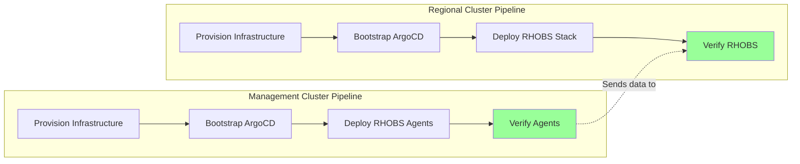
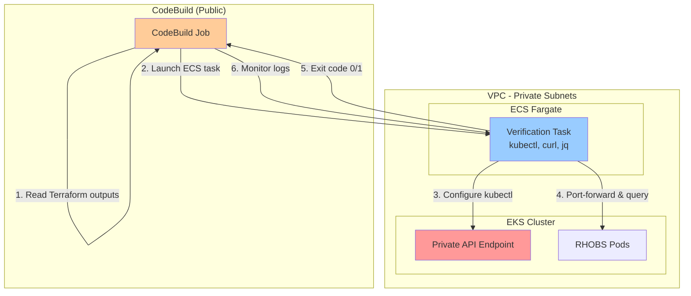
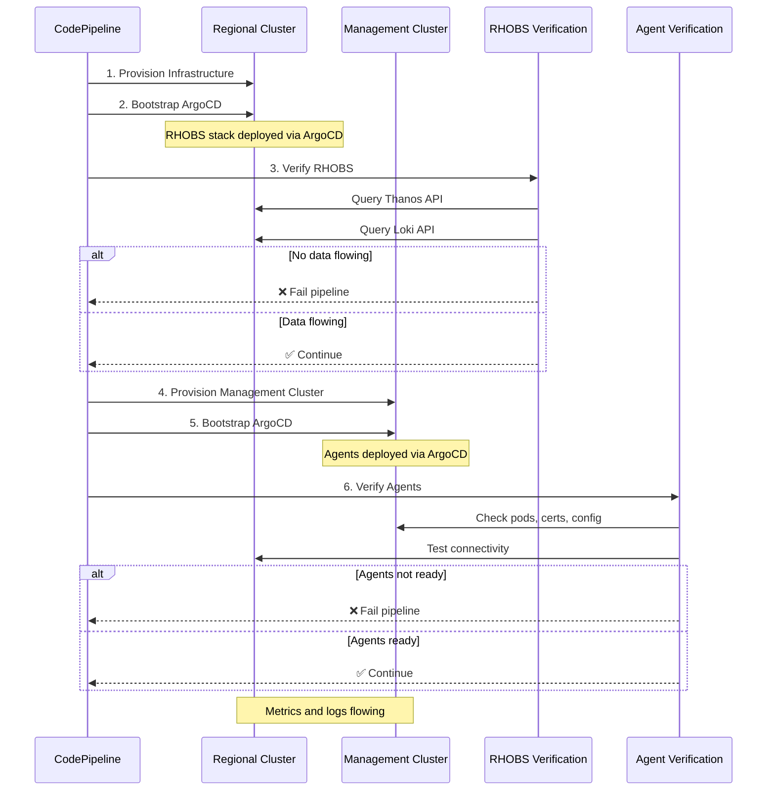

# RHOBS Pipeline Verification

This guide explains how to add automated RHOBS verification to your CI/CD pipelines to ensure metrics and logs are flowing correctly.

## Overview

Two verification stages are available:

1. **Regional Cluster Verification** - Validates that the RHOBS stack is receiving metrics and logs
2. **Management Cluster Agent Verification** - Validates that agents are properly configured and running

## Architecture

### Pipeline Flow



### ECS Fargate Verification Architecture

Since EKS clusters are **fully private** with no public API endpoints, verification must run inside the VPC:



**Key Points:**

- **No Direct Access**: CodeBuild cannot reach private EKS API endpoints
- **ECS Fargate Bridge**: Verification runs as ECS Fargate tasks in the same VPC
- **Same Pattern as Bootstrap**: Uses the existing ECS bootstrap infrastructure
- **Security**: Verification task has IAM permissions to access EKS and CloudWatch Logs

## Regional Cluster Verification

### What It Checks

- ✅ observability namespace exists
- ✅ All RHOBS component pods running (Thanos, Loki, Grafana)
- ✅ Metrics flowing from management clusters
- ✅ Logs flowing from management clusters

### How It Works

Since EKS clusters are **fully private** with no public API endpoints, verification runs as **ECS Fargate tasks** inside the VPC (same pattern as ArgoCD bootstrap):

1. CodeBuild triggers the verification buildspec
2. The buildspec reads Terraform outputs (ECS cluster ARN, task definition, etc.)
3. Launches an ECS Fargate task in the private subnets with VPC access to EKS
4. Inside the ECS task:
   - Configures kubectl to access the private EKS API
   - Queries Thanos API for `up` metrics with `cluster_id` label
   - Queries Loki API for logs with `cluster` label
   - Retries for up to 5 minutes (metrics/logs may take time to flow)
5. CodeBuild monitors the ECS task logs and exit code
6. Exits with status code 1 if no data found

### Files

- **Buildspec**: [terraform/config/pipeline-regional-cluster/buildspec-verify-rhobs.yml](../terraform/config/pipeline-regional-cluster/buildspec-verify-rhobs.yml)
- **Pipeline Script**: [scripts/buildspec/verify-rhobs.sh](../scripts/buildspec/verify-rhobs.sh) - Sets up environment and calls wrapper
- **ECS Wrapper**: [scripts/verify-rhobs-wrapper.sh](../scripts/verify-rhobs-wrapper.sh) - Launches ECS Fargate task with verification logic

### Adding to CodePipeline

#### Option 1: Add as Pipeline Stage (Recommended)

Add a new stage after ArgoCD bootstrap in your regional cluster pipeline:

```hcl
# In terraform/modules/pipeline-provisioner or your pipeline configuration
resource "aws_codepipeline_stage" "verify_rhobs" {
  name = "VerifyRHOBS"

  action {
    name             = "VerifyObservability"
    category         = "Build"
    owner            = "AWS"
    provider         = "CodeBuild"
    version          = "1"
    input_artifacts  = ["source_output"]
    output_artifacts = []

    configuration = {
      ProjectName = aws_codebuild_project.verify_rhobs.name
      EnvironmentVariables = jsonencode([
        {
          name  = "ENVIRONMENT"
          value = var.environment
          type  = "PLAINTEXT"
        },
        {
          name  = "TARGET_REGION"
          value = var.region
          type  = "PLAINTEXT"
        },
        {
          name  = "REGIONAL_ID"
          value = var.regional_id
          type  = "PLAINTEXT"
        }
      ])
    }
  }
}

resource "aws_codebuild_project" "verify_rhobs" {
  name          = "${var.regional_id}-verify-rhobs"
  service_role  = aws_iam_role.codebuild.arn
  build_timeout = 30  # 30 minutes for retries

  artifacts {
    type = "CODEPIPELINE"
  }

  environment {
    compute_type                = "BUILD_GENERAL1_SMALL"
    image                       = "aws/codebuild/standard:5.0"
    type                        = "LINUX_CONTAINER"
    image_pull_credentials_type = "CODEBUILD"
  }

  source {
    type      = "CODEPIPELINE"
    buildspec = "terraform/config/pipeline-regional-cluster/buildspec-verify-rhobs.yml"
  }
}
```

#### Option 2: Add as Post-Build Step

Add verification to the ArgoCD bootstrap buildspec:

```yaml
# In buildspec-bootstrap-argocd.yml
post_build:
  commands:
    - echo "ArgoCD bootstrap complete"
    - |
      # Wait for RHOBS deployment (optional delay)
      sleep 60
    - ./scripts/buildspec/verify-rhobs.sh
```

**Note**: This approach blocks the pipeline on verification failure.

### Manual Execution

You can manually trigger verification:

```bash
# Set environment variables
export ENVIRONMENT=staging
export TARGET_REGION=us-east-1
export REGIONAL_ID=regional-us-east-1

# Run verification
./scripts/buildspec/verify-rhobs.sh
```

## Management Cluster Agent Verification

### What It Checks

- ✅ observability namespace exists
- ✅ OTEL Collector pods running
- ✅ Fluent Bit DaemonSet pods running
- ✅ mTLS client certificate ready
- ✅ Agent configurations valid
- ✅ No critical errors in agent logs

### How It Works

The verification runs as an **ECS Fargate task** inside the VPC:

1. CodeBuild triggers the verification buildspec
2. Launches an ECS Fargate task in the management cluster's private subnets
3. Inside the ECS task:
   - Configures kubectl to access the private EKS API
   - Validates all agent pods are running
   - Checks mTLS certificate status
   - Validates agent configurations (remote_write, Loki output)
   - Scans logs for errors
4. CodeBuild monitors the ECS task logs and exit code
5. Exits with status code 1 if agents aren't properly configured

### Files

- **Buildspec**: [terraform/config/pipeline-management-cluster/buildspec-verify-rhobs-agent.yml](../terraform/config/pipeline-management-cluster/buildspec-verify-rhobs-agent.yml)
- **Pipeline Script**: [scripts/buildspec/verify-rhobs-agent.sh](../scripts/buildspec/verify-rhobs-agent.sh) - Sets up environment and calls wrapper
- **ECS Wrapper**: [scripts/verify-rhobs-agent-wrapper.sh](../scripts/verify-rhobs-agent-wrapper.sh) - Launches ECS Fargate task with verification logic

### Adding to CodePipeline

Add as a stage after ArgoCD bootstrap in management cluster pipeline:

```hcl
resource "aws_codepipeline_stage" "verify_rhobs_agent" {
  name = "VerifyRHOBSAgent"

  action {
    name             = "VerifyObservabilityAgent"
    category         = "Build"
    owner            = "AWS"
    provider         = "CodeBuild"
    version          = "1"
    input_artifacts  = ["source_output"]
    output_artifacts = []

    configuration = {
      ProjectName = aws_codebuild_project.verify_rhobs_agent.name
      EnvironmentVariables = jsonencode([
        {
          name  = "ENVIRONMENT"
          value = var.environment
          type  = "PLAINTEXT"
        },
        {
          name  = "TARGET_REGION"
          value = var.region
          type  = "PLAINTEXT"
        },
        {
          name  = "MANAGEMENT_CLUSTER_ID"
          value = var.management_cluster_id
          type  = "PLAINTEXT"
        },
        {
          name  = "MANAGEMENT_CLUSTER_SERIAL"
          value = var.serial
          type  = "PLAINTEXT"
        }
      ])
    }
  }
}

resource "aws_codebuild_project" "verify_rhobs_agent" {
  name          = "${var.management_cluster_id}-verify-rhobs-agent"
  service_role  = aws_iam_role.codebuild.arn
  build_timeout = 15  # Shorter timeout for agent checks

  artifacts {
    type = "CODEPIPELINE"
  }

  environment {
    compute_type                = "BUILD_GENERAL1_SMALL"
    image                       = "aws/codebuild/standard:5.0"
    type                        = "LINUX_CONTAINER"
    image_pull_credentials_type = "CODEBUILD"
  }

  source {
    type      = "CODEPIPELINE"
    buildspec = "terraform/config/pipeline-management-cluster/buildspec-verify-rhobs-agent.yml"
  }
}
```

### Manual Execution

```bash
# Set environment variables
export ENVIRONMENT=staging
export TARGET_REGION=us-east-1
export MANAGEMENT_CLUSTER_ID=management-us-east-1-01
export MANAGEMENT_CLUSTER_SERIAL=01

# Run verification
./scripts/buildspec/verify-rhobs-agent.sh
```

## Verification Flow

### Complete Pipeline Flow



### Verification Timeline

| Time | Event |
|------|-------|
| T+0 | RHOBS stack deployed via ArgoCD |
| T+1min | Pods start running |
| T+2min | Agent verification can run (checks pods/certs) |
| T+3-5min | First metrics arrive at Thanos |
| T+3-5min | First logs arrive at Loki |
| T+5min | Regional verification can confirm data flow |

**Recommendation**: Run agent verification immediately after deployment, but delay regional verification by 5 minutes to allow data to flow.

## Troubleshooting Failed Verifications

### Regional Cluster Verification Fails

**Symptom**: No metrics or logs found after 5 minutes

**Common Causes**:

1. **Agents not deployed**: Verify management cluster has RHOBS agents installed
   ```bash
   kubectl get pods -n observability --context management-us-east-1-01
   ```

2. **Certificate issues**: Check mTLS certificates on management clusters
   ```bash
   kubectl get certificate rhobs-client-cert -n observability --context management-us-east-1-01
   ```

3. **Network connectivity**: Verify management clusters can reach NLB endpoints
   ```bash
   # From management cluster
   curl -k https://<nlb-endpoint>:19291/-/healthy
   ```

4. **ArgoCD sync**: Ensure applications are synced
   ```bash
   kubectl get applications -n argocd --context regional-us-east-1
   ```

### Management Cluster Agent Verification Fails

**Symptom**: Pods not running or certificates not ready

**Common Causes**:

1. **ArgoCD not synced**: Wait for ArgoCD to sync the rhobs-agent application
   ```bash
   kubectl get application rhobs-agent -n argocd -o yaml
   ```

2. **cert-manager not installed**: Ensure cert-manager is running
   ```bash
   kubectl get pods -n cert-manager
   ```

3. **CA certificate not distributed**: Verify CA cert secret exists
   ```bash
   kubectl get secret rhobs-ca-cert -n observability
   ```

4. **Configuration errors**: Check Helm values are correct
   ```bash
   helm get values rhobs-agent -n observability
   ```

## Best Practices

### 1. Verification Timing

- **Agent Verification**: Run immediately after ArgoCD bootstrap (checks deployment)
- **Regional Verification**: Run 5+ minutes after agents deploy (allows data flow)

### 2. Failure Handling

- Set `on-failure: ABORT` in buildspec to fail fast
- Configure pipeline notifications for verification failures
- Use manual approval gates for production deployments

### 3. Retry Logic

- Regional verification has built-in 5-minute retry window
- CodeBuild timeout should be ≥30 minutes for regional verification
- Agent verification can use shorter timeout (15 minutes)

### 4. Monitoring

Add CloudWatch alarms for verification failures:

```hcl
resource "aws_cloudwatch_metric_alarm" "rhobs_verification_failures" {
  alarm_name          = "${var.regional_id}-rhobs-verification-failures"
  comparison_operator = "GreaterThanThreshold"
  evaluation_periods  = "1"
  metric_name         = "FailedBuilds"
  namespace           = "AWS/CodeBuild"
  period              = "300"
  statistic           = "Sum"
  threshold           = "0"
  alarm_description   = "RHOBS verification is failing"
  alarm_actions       = [aws_sns_topic.alerts.arn]

  dimensions = {
    ProjectName = aws_codebuild_project.verify_rhobs.name
  }
}
```

## Integration with Existing Pipelines

If your pipelines are already defined in Terraform, update the pipeline modules:

1. **Add CodeBuild projects** for verification (see examples above)
2. **Add pipeline stages** after ArgoCD bootstrap
3. **Configure IAM permissions** for verification scripts:

```hcl
# CodeBuild needs EKS cluster access
data "aws_iam_policy_document" "codebuild_eks" {
  statement {
    effect = "Allow"
    actions = [
      "eks:DescribeCluster",
      "eks:ListClusters"
    ]
    resources = ["*"]
  }
}

resource "aws_iam_role_policy" "codebuild_eks" {
  role   = aws_iam_role.codebuild.id
  policy = data.aws_iam_policy_document.codebuild_eks.json
}
```

4. **Update kubeconfig**: Verification scripts use `aws eks update-kubeconfig`

## Manual Verification (Alternative)

If you prefer manual verification or testing outside pipelines:

```bash
# Verify regional cluster
./scripts/verify-rhobs.sh regional-us-east-1 management-us-east-1-01

# Or use the pipeline script directly
export ENVIRONMENT=staging
export TARGET_REGION=us-east-1
export REGIONAL_ID=regional-us-east-1
./scripts/buildspec/verify-rhobs.sh
```

## Next Steps

After setting up pipeline verification:

1. **Test the pipeline** - Trigger a deployment and watch verification stages
2. **Set up notifications** - Configure SNS alerts for failures
3. **Create dashboards** - Monitor verification success rates in CloudWatch
4. **Document runbooks** - Create procedures for handling verification failures

## References

- [RHOBS Setup Guide](RHOBS-SETUP.md) - Initial RHOBS deployment
- [RHOBS Verification Guide](RHOBS-VERIFICATION.md) - Manual verification steps
- [RHOBS Architecture](diagrams/rhobs-architecture.md) - System architecture diagrams
