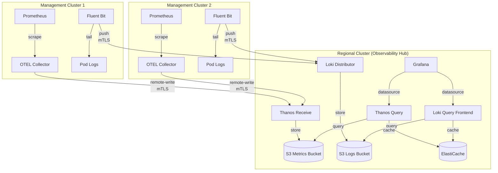

# RHOBS Observability Setup Guide

## Overview

This guide explains how to deploy the Red Hat Observability Service (RHOBS) stack on your ROSA Regional Platform using the existing GitOps and Terraform pipelines.

**RHOBS Architecture:**

- **Regional Cluster**: Hosts the centralized observability stack (Thanos, Loki, Grafana)
- **Management Clusters**: Run observability agents (OTEL Collector, Fluent Bit) to send metrics/logs
- **Authentication**: mTLS over public internet (no PrivateLink required)
- **Storage**: S3 for long-term metrics and logs retention
- **Caching**: ElastiCache (Memcached) for query performance

## Prerequisites

- Regional cluster deployed and operational
- cert-manager installed (for mTLS certificate generation)
- External Secrets Operator installed (optional, for Grafana admin password)

## Step 1: Enable RHOBS Infrastructure (Terraform)

### 1.1 Update Terraform Variables

Edit your regional cluster tfvars file (e.g., `terraform/config/regional-cluster/terraform.tfvars`):

```hcl
# Enable RHOBS observability infrastructure
enable_rhobs = true

# S3 retention configuration (adjust for your needs)
rhobs_metrics_retention_days = 90  # Days to keep metrics
rhobs_logs_retention_days    = 90  # Days to keep logs
rhobs_enable_s3_versioning   = false  # Set true for production

# ElastiCache configuration
rhobs_cache_node_type      = "cache.r6g.large"
rhobs_cache_num_nodes      = 3
rhobs_cache_engine_version = "1.6.17"
```

### 1.2 Apply Infrastructure

For **local development**:

```bash
make apply-infra-regional
```

For **CI/CD pipelines**, the infrastructure will be deployed automatically when you commit the tfvars changes.

### 1.3 Verify Infrastructure

Check the Terraform outputs:

```bash
cd terraform/config/regional-cluster
terraform output -json | jq '.rhobs_infrastructure'
```

Expected outputs:

- S3 bucket names for metrics and logs
- ElastiCache cluster endpoint
- IAM role ARNs for Thanos and Loki

## Step 2: Deploy RHOBS Stack to Regional Cluster (ArgoCD)

The RHOBS Helm chart is located at: `argocd/config/regional-cluster/rhobs/`

### 2.1 Create Values Override

The base values are in `argocd/config/regional-cluster/rhobs/values.yaml`. To customize for your environment, create an overlay in:

```
deploy/<environment>/<region>/argocd/regional-cluster-values.yaml
```

Example `deploy/integration/us-east-1/argocd/regional-cluster-values.yaml`:

```yaml
rhobs:
  # S3 configuration (from Terraform outputs)
  s3:
    metrics_bucket: "regional-us-east-1-rhobs-metrics"
    logs_bucket: "regional-us-east-1-rhobs-logs"
    region: "us-east-1"

  # ElastiCache configuration (from Terraform outputs)
  memcached:
    address: "regional-us-east-1-rhobs-cache.xyz.cfg.use1.cache.amazonaws.com"
    port: 11211

  # ServiceAccount IAM roles (from Terraform outputs)
  thanos:
    serviceAccount:
      roleArn: "arn:aws:iam::123456789012:role/regional-us-east-1-rhobs-thanos"

  loki:
    serviceAccount:
      roleArn: "arn:aws:iam::123456789012:role/regional-us-east-1-rhobs-loki"

  # Enable cert-manager for mTLS
  certManager:
    enabled: true
    caIssuer:
      create: true
      selfSigned: true  # Use external CA for production

  # Grafana admin password (recommended: use External Secrets)
  grafana:
    admin:
      existingSecret: "grafana-admin"
      existingSecretKey: "password"
```

### 2.2 Create Grafana Admin Secret

Before deploying, create the Grafana admin password secret:

```bash
kubectl create namespace observability
kubectl create secret generic grafana-admin \
  --from-literal=password='<strong-password>' \
  --namespace observability
```

**Production:** Use External Secrets Operator to sync from AWS Secrets Manager:

```yaml
apiVersion: external-secrets.io/v1beta1
kind: ExternalSecret
metadata:
  name: grafana-admin
  namespace: observability
spec:
  refreshInterval: 1h
  secretStoreRef:
    name: aws-secrets-manager
    kind: ClusterSecretStore
  target:
    name: grafana-admin
  data:
    - secretKey: password
      remoteRef:
        key: rhobs/grafana-admin-password
```

### 2.3 Deploy via ArgoCD

The `rhobs` application will be automatically deployed by the ArgoCD ApplicationSet when the configuration is present in `argocd/config/regional-cluster/rhobs/`.

Verify deployment:

```bash
kubectl get pods -n observability
```

Expected pods:

- `thanos-receive-*` (metrics ingestion)
- `thanos-query-*` (metrics query interface)
- `thanos-store-*` (S3 historical data)
- `thanos-compact-*` (metrics compaction)
- `loki-distributor-*` (logs ingestion)
- `loki-ingester-*` (logs processing)
- `loki-querier-*` (logs query)
- `grafana-*` (dashboards)

### 2.4 Get Public Endpoints

Get the NLB DNS names for metrics and logs ingestion:

```bash
# Thanos Receive endpoint (metrics)
kubectl get svc thanos-receive -n observability -o jsonpath='{.status.loadBalancer.ingress[0].hostname}'

# Loki Distributor endpoint (logs)
kubectl get svc loki-distributor -n observability -o jsonpath='{.status.loadBalancer.ingress[0].hostname}'
```

These are the public endpoints that fleet clusters will use.

## Step 3: Deploy Observability Agents to Management Clusters

The observability agents chart is located at: `argocd/config/management-cluster/rhobs-agent/`

### 3.1 Create Values Override for Management Clusters

Create `deploy/<environment>/<region>/argocd/management-cluster-values.yaml`:

```yaml
rhobsAgent:
  # RHOBS endpoints (from Step 2.4)
  rhobs:
    endpoint: "a1b2c3d4e5f6g7h8.elb.us-east-1.amazonaws.com"
    thanosReceiveUrl: "https://a1b2c3d4e5f6g7h8.elb.us-east-1.amazonaws.com:19291/api/v1/receive"
    lokiPushUrl: "https://i9j0k1l2m3n4o5p6.elb.us-east-1.amazonaws.com:3100/loki/api/v1/push"

  # mTLS authentication
  mtls:
    enabled: true
    certificateIssuer: "rhobs-ca-issuer"
    certificateIssuerKind: "ClusterIssuer"

  # OTEL Collector configuration
  otelCollector:
    enabled: true
    config:
      processors:
        resource:
          attributes:
            - key: cluster_id
              value: "{{ .Values.global.cluster_name }}"
              action: upsert
            - key: region
              value: "{{ .Values.global.aws_region }}"
              action: upsert

  # Fluent Bit configuration
  fluentBit:
    enabled: true
```

### 3.2 Deploy via ArgoCD ApplicationSet

The agents will be automatically deployed to all management clusters via the ArgoCD ApplicationSet.

Verify on each management cluster:

```bash
kubectl get pods -n observability
```

Expected pods:

- `otel-collector-*` (metrics collection)
- `fluent-bit-*` (log collection DaemonSet on all nodes)

### 3.3 Verify mTLS Certificates

Check that cert-manager created client certificates:

```bash
kubectl get certificate -n observability
kubectl get secret rhobs-client-cert -n observability
```

## Step 4: Configure cert-manager CA Issuer

### 4.1 Create CA Certificate (Regional Cluster)

On the regional cluster, create a self-signed CA for development:

```yaml
apiVersion: cert-manager.io/v1
kind: ClusterIssuer
metadata:
  name: rhobs-ca-issuer
spec:
  ca:
    secretName: rhobs-ca-key-pair
```

Generate the CA keypair:

```bash
# Generate CA private key
openssl genrsa -out ca.key 4096

# Generate CA certificate
openssl req -new -x509 -sha256 -key ca.key -out ca.crt -days 3650 \
  -subj "/CN=RHOBS CA/O=ROSA Regional Platform"

# Create Kubernetes secret
kubectl create secret tls rhobs-ca-key-pair \
  --cert=ca.crt \
  --key=ca.key \
  --namespace cert-manager
```

**Production:** Use an external CA like AWS Private CA or HashiCorp Vault.

### 4.2 Distribute CA Certificate to Management Clusters

Copy the CA certificate to all management clusters:

```bash
# Get CA cert from regional cluster
kubectl get secret rhobs-ca-key-pair -n cert-manager -o jsonpath='{.data.tls\.crt}' | base64 -d > rhobs-ca.crt

# Create secret on management cluster
kubectl create secret generic rhobs-ca-cert \
  --from-file=ca.crt=rhobs-ca.crt \
  --namespace observability
```

Or use External Secrets to sync from AWS Secrets Manager.

## Step 5: Validation

### 5.1 Check Metrics Flow

Access Grafana:

```bash
kubectl port-forward -n observability svc/grafana 3000:3000
```

Open [http://localhost:3000](http://localhost:3000) and:

1. Login with admin credentials
2. Go to Explore → Thanos datasource
3. Run query: `up{cluster_id="<management-cluster-name>"}`
4. Verify metrics are flowing from management clusters

### 5.2 Check Logs Flow

In Grafana Explore → Loki datasource:

1. Select label filters: `cluster=<management-cluster-name>`
2. Verify logs are appearing from fleet clusters

### 5.3 Check Thanos Query

```bash
kubectl port-forward -n observability svc/thanos-query 9090:9090
```

Open [http://localhost:9090](http://localhost:9090) and verify:

- Stores are connected (Check "Stores" page)
- Metrics are queryable

### 5.4 Check S3 Storage

Verify objects are being written to S3:

```bash
aws s3 ls s3://regional-us-east-1-rhobs-metrics/ --recursive | head
aws s3 ls s3://regional-us-east-1-rhobs-logs/ --recursive | head
```

## Step 6: Production Hardening

### 6.1 Enable Multi-AZ for RDS

If using RDS for any observability components, enable Multi-AZ in tfvars.

### 6.2 Use External CA

Replace self-signed CA with AWS Private CA or external PKI.

### 6.3 Secure Grafana Access

- Use AWS Cognito or SSO for authentication
- Configure Grafana OAuth

### 6.4 Set Up Alerting

Configure Alertmanager receivers in `argocd/config/regional-cluster/rhobs/values.yaml`:

```yaml
alertmanager:
  config:
    receivers:
      - name: pagerduty
        pagerduty_configs:
          - routing_key_file: /secrets/pagerduty-key
            severity: critical
      - name: slack
        slack_configs:
          - api_url_file: /secrets/slack-webhook
            channel: '#alerts'
```

### 6.5 Enable S3 Versioning

For production, set `rhobs_enable_s3_versioning = true` in tfvars.

### 6.6 Configure Lifecycle Policies

Adjust retention in tfvars based on compliance requirements.

## Troubleshooting

### Metrics Not Appearing

1. Check OTEL Collector logs:
   ```bash
   kubectl logs -n observability -l app.kubernetes.io/component=otel-collector
   ```

2. Verify mTLS certificates are valid:
   ```bash
   kubectl get certificate -n observability
   ```

3. Test connectivity to Thanos Receive:
   ```bash
   curl -k https://<nlb-endpoint>:19291/-/healthy
   ```

### Logs Not Appearing

1. Check Fluent Bit logs:
   ```bash
   kubectl logs -n observability -l app.kubernetes.io/component=fluent-bit
   ```

2. Verify Loki Distributor is healthy:
   ```bash
   kubectl logs -n observability -l app.kubernetes.io/component=loki-distributor
   ```

### S3 Access Issues

1. Check Pod Identity associations:
   ```bash
   aws eks list-pod-identity-associations --cluster-name <cluster-name>
   ```

2. Verify IAM role trust policy allows EKS Pod Identity service principal

### Certificate Issues

1. Check cert-manager logs:
   ```bash
   kubectl logs -n cert-manager -l app=cert-manager
   ```

2. Verify CA issuer exists:
   ```bash
   kubectl get clusterissuer rhobs-ca-issuer
   ```

## Architecture Diagram



## References

- [RHOBS to EKS Translation Guide](../rhobs-to-eks-guide.md)
- [Thanos Documentation](https://thanos.io/tip/thanos/quick-tutorial.md)
- [Grafana Loki Documentation](https://grafana.com/docs/loki/latest/)
- [OpenTelemetry Collector](https://opentelemetry.io/docs/collector/)
- [Fluent Bit Documentation](https://docs.fluentbit.io/)
