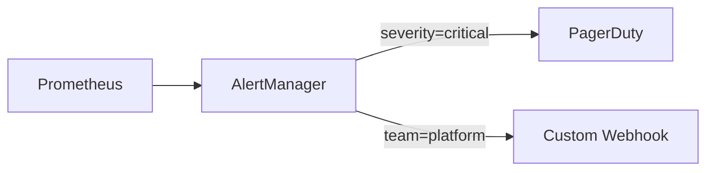
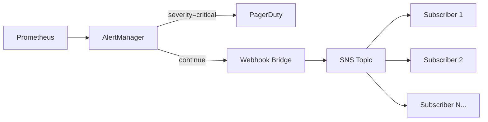

# Alerting Architecture: Fan-Out Alert Routing

## Overview

This document describes the alerting architecture for the ROSA Regional Platform. The system routes Prometheus alerts from AlertManager to multiple receivers with selective, label-based filtering. The design is split into two phases:

- **Phase 1**: Native AlertManager routing with `continue`-based fan-out
- **Phase 2**: SNS/SQS fan-out for decoupled, durable alert distribution

## Phase 1: Native AlertManager Routing

### Design

AlertManager's built-in route tree supports fan-out via the `continue: true` directive. When a route matches and `continue` is set, AlertManager keeps evaluating subsequent sibling routes — allowing a single alert to reach multiple receivers.

Selective routing is handled by matching on alert labels (e.g., `severity`, `team`, `component`).



### Example AlertManager Configuration

```yaml
global:
  resolve_timeout: 5m

route:
  receiver: default
  group_by: ["alertname", "namespace"]
  group_wait: 30s
  group_interval: 5m
  repeat_interval: 4h
  routes:
    # Critical alerts → PagerDuty
    - match:
        severity: critical
      receiver: pagerduty
      continue: true # continue evaluating sibling routes

    # Platform team alerts → custom webhook handler
    - match:
        team: platform
      receiver: platform-webhook
      continue: true

receivers:
  - name: default
    # fallback — no-op or a generic Slack channel

  - name: pagerduty
    pagerduty_configs:
      - service_key_file: /etc/alertmanager/secrets/pagerduty-service-key

  - name: platform-webhook
    webhook_configs:
      - url: "http://platform-alert-handler.alerting.svc.cluster.local:8080/alerts"
        send_resolved: true
```

### How Routing Works

1. An alert fires with labels like `severity=critical, team=platform, alertname=HighErrorRate`.
2. AlertManager evaluates routes top-to-bottom:
   - Matches `severity: critical` → sends to PagerDuty. `continue: true` → keeps evaluating.
   - Matches `team: platform` → sends to platform webhook.
3. Result: the single alert reaches two receivers.

An alert with `severity=warning, team=storage` would skip PagerDuty and skip the platform webhook, falling through to the default receiver.

### Adding a New Receiver

1. Add a new `receiver` entry in the AlertManager config.
2. Add a new `route` entry with the appropriate label matchers and `continue: true` if further fan-out is needed.
3. Reload AlertManager (config reload or pod restart).

### Limitations

- **Coupling**: Every new receiver requires an AlertManager config change and reload.
- **Availability**: If a webhook receiver is down, AlertManager retries with exponential backoff, but has limited buffering. Extended outages can cause alert loss.
- **Blast radius**: A misconfigured route change can break routing for all alerts.
- **Scale**: Works well for a handful of receivers. Beyond ~10 receivers with complex routing logic, the config becomes difficult to maintain.

## Phase 2: SNS/SQS Fan-Out (Extension of Phase 1)

### Design

Phase 2 extends Phase 1 by adding an SNS/SQS fan-out path alongside the existing AlertManager routes. The Phase 1 PagerDuty route remains in place — it continues to receive critical alerts directly from AlertManager with no additional latency or dependencies. A new webhook bridge route is added using `continue: true`, publishing alerts to an SNS topic that fans out to SQS queues for additional consumers.

This additive approach means Phase 2 can be rolled out without disrupting the existing PagerDuty integration. The SNS/SQS path handles receiver growth and decoupled consumption, while the battle-tested PagerDuty route stays as-is.



### Components

#### Webhook Bridge

A lightweight service running in the alerting namespace that:

1. Receives AlertManager webhook POST requests
2. Maps alert labels to SNS message attributes
3. Publishes to the SNS topic

```
POST /alerts (from AlertManager)
  → Extract labels: severity, team, alertname, namespace, ...
  → Publish to SNS with MessageAttributes:
      severity: "critical"
      team: "platform"
      alertname: "HighErrorRate"
      status: "firing"
```

The bridge is added as an additional receiver alongside the existing Phase 1 routes:

```yaml
route:
  receiver: default
  group_by: ["alertname", "namespace"]
  group_wait: 30s
  group_interval: 5m
  repeat_interval: 4h
  routes:
    # Phase 1 — Critical alerts → PagerDuty (unchanged)
    - match:
        severity: critical
      receiver: pagerduty
      continue: true

    # Phase 2 — All alerts → SNS fan-out
    - match_re:
        alertname: ".*"
      receiver: sns-bridge

receivers:
  - name: default
    # fallback — no-op or a generic Slack channel

  - name: pagerduty
    pagerduty_configs:
      - service_key_file: /etc/alertmanager/secrets/pagerduty-service-key

  - name: sns-bridge
    webhook_configs:
      - url: "http://alert-sns-bridge.alerting.svc.cluster.local:8080/alerts"
        send_resolved: true
```

#### SNS Topic

A single SNS topic (`rrp-alerts`) receives all alerts. No routing logic lives here — SNS just fans out to all subscriptions, with each subscription's filter policy controlling what it receives.

#### Subscribers

Any number of subscribers can be added to the SNS topic. SNS natively supports multiple subscription protocols — subscribers are not limited to SQS queues. Options include:

- **SQS** — durable queue with retry and DLQ support, ideal for asynchronous processing
- **Lambda** — direct invocation for lightweight, event-driven consumers
- **HTTPS** — push to an external endpoint (e.g., a third-party webhook)
- **Email/SMS** — for human notification paths

Each subscription can include a [filter policy](https://docs.aws.amazon.com/sns/latest/dg/sns-subscription-filter-policies.html) to selectively receive alerts based on message attributes (mapped from alert labels). Subscribers without a filter policy receive all alerts.

```json
// Example: only receive critical alerts
{
  "severity": ["critical"]
}

// Example: only receive platform team alerts
{
  "team": ["platform"]
}
```

> **Note:** PagerDuty is _not_ an SNS subscriber — it receives critical alerts directly from AlertManager via the Phase 1 route. This avoids adding latency or an SNS dependency to the paging path.

Subscribers are fully independent — deployed, scaled, and owned by different teams if needed.

### Terraform Sketch

```hcl
resource "aws_sns_topic" "alerts" {
  name = "rrp-alerts"
}

# Example: SQS subscriber with filter policy
resource "aws_sqs_queue" "example_alerts" {
  name = "rrp-alerts-example"
  redrive_policy = jsonencode({
    deadLetterTargetArn = aws_sqs_queue.example_alerts_dlq.arn
    maxReceiveCount     = 3
  })
}

resource "aws_sqs_queue" "example_alerts_dlq" {
  name = "rrp-alerts-example-dlq"
}

resource "aws_sns_topic_subscription" "example_sqs" {
  topic_arn = aws_sns_topic.alerts.arn
  protocol  = "sqs"
  endpoint  = aws_sqs_queue.example_alerts.arn
  filter_policy = jsonencode({
    team = ["platform"]
  })
}

# Example: Lambda subscriber (no filter — receives all alerts)
resource "aws_sns_topic_subscription" "example_lambda" {
  topic_arn = aws_sns_topic.alerts.arn
  protocol  = "lambda"
  endpoint  = aws_lambda_function.alert_handler.arn
}
```

### Adding a New Subscriber (Phase 2)

1. Subscribe to the SNS topic using the appropriate protocol (SQS, Lambda, HTTPS, etc.) with an optional filter policy.
2. If using SQS, create the queue + DLQ (Terraform).
3. Deploy the subscriber.

No AlertManager changes required. No bridge changes required. The PagerDuty route is untouched. New subscribers are fully decoupled via the SNS topic.

### What Phase 2 Adds Over Phase 1

| Concern                   | Phase 1 only                        | Phase 2 (Phase 1 + SNS/SQS)                                                      |
| ------------------------- | ----------------------------------- | -------------------------------------------------------------------------------- |
| PagerDuty path            | Direct AlertManager → PagerDuty     | Unchanged — same direct path                                                     |
| New subscriber onboarding | Config change + AlertManager reload | Subscribe to SNS topic + deploy (no AlertManager change)                         |
| Durability                | Limited retry/buffering             | Depends on protocol — SQS provides retention + DLQ; Lambda retries automatically |
| Coupling                  | All receivers in one config         | Only PagerDuty in AlertManager; all others decoupled via SNS                     |
| Filtering                 | AlertManager label matching         | SNS subscription filter policies                                                 |
| Cross-account/region      | Difficult                           | Native SNS/SQS cross-account support                                             |
| Observability             | AlertManager metrics                | AlertManager metrics + CloudWatch metrics per subscriber                         |
| Additional infrastructure | None                                | SNS topic, bridge service, subscriber resources                                  |

### Failure Modes

- **Bridge is down**: AlertManager retries with backoff. Alerts are delayed but not lost (within AlertManager's retry window).
- **SNS publish fails**: Bridge should retry with backoff and log failures. Consider a local buffer or DLQ within the bridge for extreme cases.
- **Subscriber is down**: Out of scope. Once an alert is published to the SNS topic, delivery to subscribers is the responsibility of SNS and the subscriber. The platform's obligation ends at successful SNS publish.

## Open Questions

- [ ] What alert labels should be mapped to SNS message attributes? (SNS supports up to 10 attributes per message.)
- [ ] Should the webhook bridge run as a Deployment in the alerting namespace or as a Lambda behind an API Gateway VPC endpoint?
- [ ] Do we need cross-region alert replication, or is per-region alerting sufficient given regional independence?
