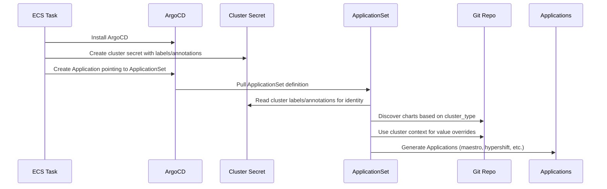
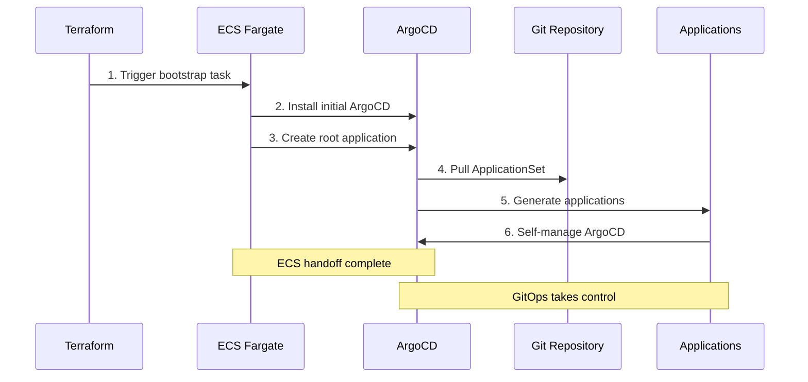
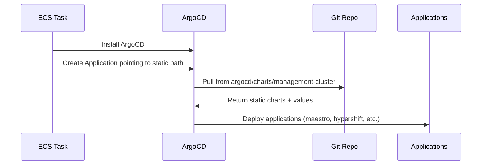
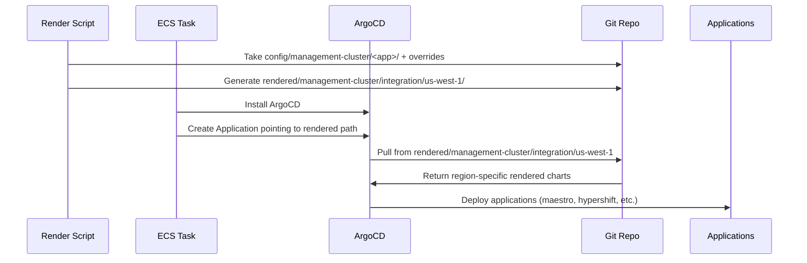
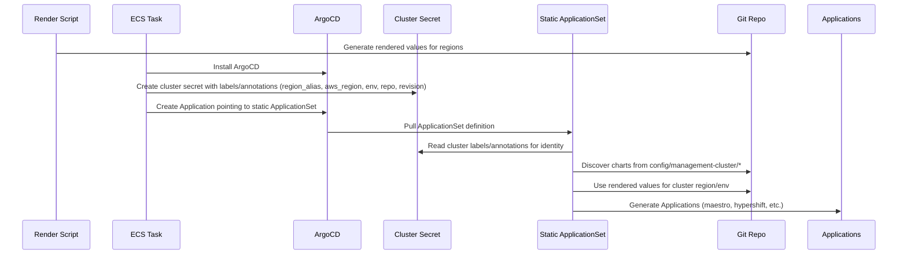

# GitOps Cluster Configuration Architecture

**Last Updated Date**: 2026-02-02

## Summary

The ROSA Regional Platform implements a sophisticated GitOps cluster configuration system using ArgoCD ApplicationSets with matrix generators that enables scalable, versioned, and region-aware deployment of applications across multiple clusters while maintaining regional independence and progressive deployment capabilities.

## Context

The ROSA Regional Platform is architected from the ground up as a regionally-distributed system where each cluster (Regional Clusters and Management Clusters) operates independently with its own ArgoCD instance for self-configuration. Within each region (containing 1 Regional Cluster + 1 to N Management Clusters), the configuration management system must support this cluster independence while sharing common application definitions and enabling coordinated deployments across environments.

- **Problem Statement**: How to manage application configuration across multiple regions and environments while supporting independent regional operations, progressive deployments, and maintaining audit trails for production safety
- **Constraints**: Must integrate with fully private EKS clusters, support region-specific customizations, enable version control for production deployments, and scale to hundreds of regions
- **Assumptions**: GitOps is the primary deployment mechanism, ArgoCD is the GitOps controller, and teams require both development velocity and production safety controls

## Architecture Overview

The ROSA Regional Platform implements a GitOps cluster configuration system using ArgoCD ApplicationSets with hash-based versioning for production-grade deployment controls while maintaining regional independence.

### Foundation Concepts

**ECS Bootstrap Process**: Each cluster starts completely private with no external access. AWS ECS Fargate tasks running in the cluster's private subnets provide the secure mechanism to install ArgoCD and create the initial application and the cluster identity secret. This is part of the overall bootstrap process that provisions private EKS clusters. Once ECS completes the handoff, ArgoCD takes full control.

**ArgoCD ApplicationSets**: ArgoCD's ApplicationSet controller automatically generates multiple ArgoCD Applications based on templates and generators. Instead of manually creating dozens of Applications for each cluster, we use one ApplicationSet that discovers applications and clusters dynamically.

**Matrix Generators**: ApplicationSets support different generator types. We use a "matrix" generator that combines two other generators:
- **Cluster Generator**: Finds clusters to deploy to (in our case, finds the cluster's own identity)
- **Git Generator**: Discovers applications to deploy by scanning repository directories

The matrix creates the cartesian product: 1 cluster × N applications = N Applications for that cluster.

**Cluster Identity Secret**: Each cluster has a Kubernetes secret that serves as its identity, containing labels (cluster_type, environment, region_alias, aws_region) and annotations (git repository, revision) that ApplicationSets use to determine what and how to deploy.

### GitOps Configuration Flow

The core bootstrap and configuration process follows this flow:



**Core Process**: ECS bootstrap creates the cluster identity secret and initial Application. ArgoCD then takes over, using the ApplicationSet to dynamically discover and deploy applications based on the cluster's identity.

### ApplicationSet Matrix Generator Pattern

Each cluster uses a **rendered ApplicationSet** that's customized per environment through the render script. The render script creates environment-specific ApplicationSets with hash overrides for production deployments.

**Integration Environment (Live Config)**:
```yaml
# deploy/integration/eu-west-1/argocd/management-cluster-manifests/applicationset.yaml
apiVersion: argoproj.io/v1alpha1
kind: ApplicationSet
metadata:
  name: root-applicationset
  namespace: argocd
spec:
  generators:
    - matrix:
        generators:
          - clusters:
              selector:
                matchLabels:
                  argocd.argoproj.io/secret-type: cluster
          - git:
              directories:
                - path: argocd/config/{{ .metadata.labels.cluster_type }}/*
                - path: argocd/config/shared/*
              repoURL: '{{ .metadata.annotations.git_repo }}'
              # Integration: Uses git_revision from cluster secret (main branch)
              revision: '{{ .metadata.annotations.git_revision }}'
  template:
    spec:
      sources:
        # Source 1: Charts + default values (from cluster secret revision)
        - path: '{{ .path.path }}'
          helm:
            valueFiles:
              - values.yaml  # Chart defaults
              - $values/deploy/{{ .metadata.labels.environment }}/{{ .metadata.labels.region_alias }}/argocd/{{ .metadata.labels.cluster_type }}-values.yaml
          repoURL: '{{ .metadata.annotations.git_repo }}'
          targetRevision: '{{ .metadata.annotations.git_revision }}'  # From cluster secret

        # Source 2: Rendered values (from cluster secret revision)
        - ref: values
          repoURL: '{{ .metadata.annotations.git_repo | replace "github.com" "github.com:443" }}'  # Workaround for duplicate repo
          targetRevision: '{{ .metadata.annotations.git_revision }}'  # From cluster secret
```

**Staging/Production (Hash-Pinned Config)**:
```yaml
# deploy/staging/eu-west-1/argocd/management-cluster-manifests/applicationset.yaml
apiVersion: argoproj.io/v1alpha1
kind: ApplicationSet
metadata:
  name: root-applicationset
  namespace: argocd
spec:
  generators:
    - matrix:
        generators:
          - clusters:
              selector:
                matchLabels:
                  argocd.argoproj.io/secret-type: cluster
          - git:
              directories:
                - path: argocd/config/{{ .metadata.labels.cluster_type }}/*
                - path: argocd/config/shared/*
              repoURL: '{{ .metadata.annotations.git_repo }}'
              # Staging/Prod: Uses pinned commit hash from config.yaml
              revision: 826fa76d08fc2ce87c863196e52d5a4fa9259a82
  template:
    spec:
      sources:
        # Source 1: Charts + default values (pinned to specific commit)
        - path: '{{ .path.path }}'
          helm:
            valueFiles:
              - values.yaml  # Chart defaults from pinned commit
              - $values/deploy/{{ .metadata.labels.environment }}/{{ .metadata.labels.region_alias }}/argocd/{{ .metadata.labels.cluster_type }}-values.yaml
          repoURL: '{{ .metadata.annotations.git_repo }}'
          targetRevision: 826fa76d08fc2ce87c863196e52d5a4fa9259a82  # Pinned commit hash

        # Source 2: Rendered values (still from cluster secret for latest config)
        - ref: values
          repoURL: '{{ .metadata.annotations.git_repo | replace "github.com" "github.com:443" }}'  # Workaround for duplicate repo
          targetRevision: '{{ .metadata.annotations.git_revision }}'  # From cluster secret (latest values)
```

**Key Implementation Details**:

1. **Rendered ApplicationSets**: The render script creates environment-specific ApplicationSets with hardcoded commit hashes for staging/production, enabling hash-based versioning.

2. **Hash Override Mechanism**:
   - **Integration**: Uses `'{{ .metadata.annotations.git_revision }}'` from cluster secret (typically main branch)
   - **Staging/Production**: Uses hardcoded commit hash (e.g., `826fa76d08fc2ce87c863196e52d5a4fa9259a82`) rendered from `config.yaml`

3. **Dual Source Strategy**:
   - **Charts**: Pinned to specific commits for staging/production stability
   - **Values**: Always use cluster secret revision for latest environment configuration

4. **GitHub Workaround**: The `replace "github.com" "github.com:443"` in the values source avoids ArgoCD issues with duplicate repository references.

5. **Matrix Result**: If Git discovers 3 directories (hypershift, maestro, argocd), the matrix creates 3 Applications for that cluster, each using the appropriate chart version and latest rendered values.

### Configuration Hierarchy

Helm charts use a simple two-layer configuration system:

1. **Chart Defaults**: Each chart defines default values in `argocd/config/*/values.yaml`
2. **Rendered Overrides**: Region/environment-specific values from `deploy/<env>/<region_alias>/argocd/` override defaults

```yaml
# ApplicationSet uses both sources
sources:
  - path: argocd/config/management-cluster/hypershift  # Chart + defaults
    helm:
      valueFiles:
        - values.yaml  # Chart defaults
        - $values/deploy/{{ .environment }}/{{ .region_alias }}/argocd/management-cluster-values.yaml  # Overrides
  - ref: values  # Rendered overrides source
    repoURL: https://github.com/openshift-online/rosa-platform
    targetRevision: HEAD
```

**Example**:
- Chart default: `hypershift.replicas: 1`
- Rendered override: `hypershift.replicas: 3`
- **Result**: `hypershift.replicas: 3` (override wins)

## Private Cluster GitOps Integration

### Bootstrap-then-Handoff Pattern

The GitOps system integrates seamlessly with the fully private cluster architecture through a carefully orchestrated handoff process:



### GitOps Handoff Implementation

**Application of Applications Pattern**: The ECS bootstrap task creates a single root ArgoCD application that immediately enables complete self-management:

1. **Initial ArgoCD Installation**: ECS Fargate task installs ArgoCD components using Helm within the private cluster network
2. **Root Application Creation**: ECS task creates the initial ArgoCD application pointing to the Git repository's ApplicationSet configuration
3. **Immediate Handoff**: ArgoCD immediately takes control by pulling the ApplicationSet from Git, which generates all subsequent applications
4. **Self-Configuration**: The ApplicationSet includes ArgoCD's own configuration, enabling complete self-management via GitOps

### ArgoCD Self-Management Architecture

**Bootstrap-then-Handoff Pattern**: After the initial ECS-based installation, ArgoCD manages its own updates by pulling its chart version from the self-owning application within the ApplicationSet matrix.

**Self-Management Benefits**:
- **Zero External Dependencies**: No ongoing external access required for cluster configuration management
- **Audit Trail Preservation**: All changes tracked through Git commits, including ArgoCD's own updates
- **Version Control**: ArgoCD version pinning through the same `config_revision` mechanism used for other applications
- **Cluster Independence**: Each cluster's ArgoCD operates independently, enabling autonomous regional operations without cross-cluster dependencies

## Progressive Deployment Strategy

### Sector-Based Release Management

The architecture enables sophisticated deployment patterns through sector configuration:

```yaml
# Sector progression example
region_deployments:
  # Integration: Always HEAD for rapid development
  - name: "us-east-1"
    aws_region: "us-east-1"
    sector: "integration"
    # No config_revision = follows HEAD of repository

  # Staging: Pinned commits for QA validation
  - name: "eu-west-1"
    aws_region: "eu-west-1"
    sector: "staging"
    config_revision:
      management-cluster: "826fa76d08fc2ce87c863196e52d5a4fa9259a82"
      regional-cluster: "826fa76d08fc2ce87c863196e52d5a4fa9259a82"

  # Production: Promoted commits with explicit approval
  - name: "eu-west-1"
    aws_region: "eu-west-1"
    sector: "production"
    config_revision:
      management-cluster: "7f8a9b2c15e4d3c6f9a8b7e6d5c4b3a2f1e0d9c8"
      regional-cluster: "7f8a9b2c15e4d3c6f9a8b7e6d5c4b3a2f1e0d9c8"
```

## Cross-Cutting Concerns

### Operability

**Configuration Management**:
- Single `config.yaml` file provides clear configuration entry point
- Automated rendering creates single configuration file entrypoint for the whole fleet
- Git-based workflow integrates with standard development practices
- Clear separation between chart definitions and environment customization

**Troubleshooting**:
- ArgoCD UI provides comprehensive application health visualization
- Git commit history enables configuration change tracking
- Rendered value files provide clear visibility into final configuration

**Emergency Procedures**:
- Git revert capabilities enable rapid rollback
- Manual Application and cluster identity secret can be updated by re-running ECS task if needed
- Cluster-level ArgoCD isolation prevents cross-cluster impact

## Alternatives Considered

Through a systematic proof-of-concept evaluation process, three alternative configuration approaches were evaluated and rejected:

### 1. Static Repository Paths
**Approach**: ECS task installs ArgoCD on cluster and creates application pointing at static path for management cluster applications



```yaml
# Application created by ECS task
apiVersion: argoproj.io/v1alpha1
kind: Application
spec:
  source:
    path: argocd/charts/management-cluster
    repoURL: https://github.com/openshift-online/rosa-platform
    targetRevision: HEAD
```

**Pros**:
- Minimal configuration overhead
- Simple to understand and implement
- Single source of truth for all clusters

**Cons**:
- No region-specific configurations possible
- Doesn't support regional independence goal
- All clusters forced to same application versions
- Cannot handle environment-specific values

**Decision**: Rejected - too limiting for multi-region requirements

### 2. Dynamic Repository Paths
**Approach**: ECS task installs ArgoCD on cluster and creates application pointing at path by region/env, e.g. `rendered/management-cluster/integration/us-west-1`. Render script creates duplicated/rendered apps for each region.



**Repository Structure**:
```
config/management-cluster/
├── maestro/
│   ├── Chart.yaml
│   ├── values.yaml (defaults)
│   └── integration/us-west-1/  # Override yamls/applications (values set in rendered/)
└── hypershift/
    ├── Chart.yaml
    ├── values.yaml (defaults)
    └── integration/us-west-1/  # Override yamls/applications (values set in rendered/)

rendered/management-cluster/integration/us-west-1/  # Generated by render script
├── maestro/
│   ├── Chart.yaml (copied)
│   └── values.yaml (merged with overrides)
└── hypershift/
    ├── Chart.yaml (copied)
    └── values.yaml (merged with overrides)
```

```yaml
# Application created by ECS task
apiVersion: argoproj.io/v1alpha1
kind: Application
spec:
  source:
    path: rendered/management-cluster/integration/us-west-1
    repoURL: https://github.com/openshift-online/rosa-platform
    targetRevision: HEAD
```

**CI/CD Characteristics**:
- Single component updates cascade across regions by updating overrides through regions for single app roll-out
- Very fast for individual component propagation
- Each region can independently lag behind or advance beyond others

**Pros**:
- Simple implementation with familiar patterns
- Region-specific configurations fully supported
- Independent region deployment control
- Excellent visibility - very easy to see what's deployed by browsing directories
- Fast single application updates across regions
- Standardization benefit - used by gcp-hcp team

**Cons**:
- Chart duplication across all regions in rendered directories
- Maintenance overhead scales with region count
- Version drift risk between regions
- Repository size growth becomes problematic
- Testing complexity - configurations can differ vastly between regions, reducing test confidence


### 3. ApplicationSet with Dynamic Paths
**Approach**: ECS task installs ArgoCD, creates cluster secret for cluster identity with labels/annotations (region_alias, aws_region, env, cluster name, repository, revision), creates application that points at a static ApplicationSet which uses cluster secret labels to point at the right charts based on cluster type, and uses region specific values created through render script.



```yaml
# Cluster secret created by ECS task (cluster identity)
apiVersion: v1
kind: Secret
metadata:
  name: management-cluster-us-west-1-staging
  namespace: argocd
  labels:
    argocd.argoproj.io/secret-type: cluster
    cluster_type: management-cluster
    environment: staging
    region_alias: us-west-1
    aws_region: us-west-1
  annotations:
    cluster_name: management-cluster-us-west-1-staging
    git_repo: https://github.com/openshift-online/rosa-platform
    git_revision: HEAD  # Allows changes for dev
type: Opaque

# Application created by ECS task
apiVersion: argoproj.io/v1alpha1
kind: Application
spec:
  source:
    path: argocd/applicationsets
    repoURL: https://github.com/openshift-online/rosa-platform
    targetRevision: HEAD

# Static ApplicationSet definition
apiVersion: argoproj.io/v1alpha1
kind: ApplicationSet
metadata:
  name: management-cluster-apps
spec:
  generators:
    - matrix:
        generators:
          - clusters:
              selector:
                matchLabels:
                  argocd.argoproj.io/secret-type: cluster
          - git:
              directories:
                - path: argocd/config/management-cluster/*
              repoURL: '{{ .metadata.annotations.git_repo }}'
              revision: '{{ .metadata.annotations.git_revision }}'
  template:
    spec:
      source:
        path: '{{ .path.path }}'
        helm:
          valueFiles:
            - values.yaml
            - ../../../rendered/{{ .metadata.labels.environment }}/{{ .metadata.labels.region_alias }}/management-cluster-values.yaml
```

**Pros**:
- Eliminates chart duplication completely
- Consistent chart versions across regions
- Dynamic application discovery
- Scales efficiently with region growth
- Single ApplicationSet manages all regions

**Cons**:
- Abstraction layer reduces visibility - harder to see what's deployed without understanding ApplicationSet logic
- No explicit versioning control for production safety
- All regions follow same chart commits automatically
- Limited progressive deployment capabilities

**Decision**: Rejected - good foundation but lacks production deployment controls

## Continuous Delivery Evaluation: Option 2 vs Current Approach

**Option 2 Trade-offs**:
- Very fast individual component propagation region by region
- Could implement cascading updates across regions by overriding from canonical region
- Each region can have different versions, reducing test confidence
- Requires complex tooling to manage region-to-region propagation

**Current Approach Trade-offs**:
- Trades single component speed for comprehensive bundle testing
- All regions deploy identical, fully-tested chart combinations
- Single configuration file controls all deployments
- Clear integration → staging → production progression with explicit approval gates

Option 2 optimizes for speed of individual component updates but accepts testing complexity. With Option 2 we could have had a single component roll out through regions by overriding from one and having that override continue through regions. However, this adds additional complexity and reduces testability.

Our current approach optimizes for testing confidence and operational safety but accepts slower individual component velocity. We trade the speed of updating single components for fully tested hashes that comprise a bundle of helm charts at a certain version, making testing easier.
