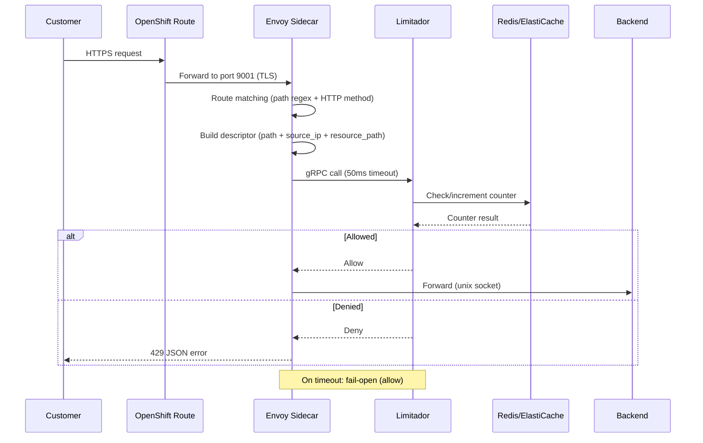

# ROSA Hyperfleet (v2): Platform API Rate Limiting

**Last Updated Date**: 2026-06-25

## Table of Contents

- [Summary](#summary)
- [Context](#context)
- [Current Implementation — ROSA HCP (v1): Envoy + Limitador](#current-implementation--rosa-hcp-v1-envoy--limitador)
- [Alternatives Considered for ROSA Hyperfleet (v2)](#alternatives-considered-for-rosa-hyperfleet-v2)
  - [1. AWS WAF Rate-Based Rules](#1-aws-waf-rate-based-rules)
  - [2. API Gateway Route-Level Throttling](#2-api-gateway-route-level-throttling)
  - [3. Usage Plans + API Keys](#3-usage-plans--api-keys)
  - [4. Lambda Authorizer](#4-lambda-authorizer-with-rate-limiting-logic)
  - [5. In-Application Rate Limiter (Recommended)](#5-in-application-rate-limiter-recommended-primary-mechanism)
- [Design Rationale](#design-rationale)
  - [Phase 1 (initial implementation)](#phase-1-initial-implementation)
  - [Phase 2 (if needed)](#phase-2-if-needed-based-on-observability-data)
- [Consequences](#consequences)
- [Multi-Replica Enforcement](#multi-replica-enforcement)
- [Key Granularity](#key-granularity)
- [Implementation Reference](#implementation-reference)
- [Cross-Cutting Concerns](#cross-cutting-concerns)

## Summary

This document captures the current ROSA HCP (v1) rate limiting implementation (Envoy sidecar + Limitador) and evaluates alternatives for ROSA Hyperfleet (v2), where the API is served through AWS API Gateway with SigV4 authentication. The recommended approach is an in-app rate limiter using `go-redis/redis_rate` with shared Redis counters, complemented by API Gateway's existing route-level throttling.

## Context

- **Problem Statement**: ROSA HCP (v1) uses Envoy sidecars with Limitador (backed by Redis/ElastiCache) for per-endpoint, per-customer rate limiting. ROSA Hyperfleet (v2) replaces the Envoy-based ingress with AWS API Gateway using SigV4 authentication. We need an equivalent rate limiting strategy that provides per-customer, per-endpoint granularity.
- **Constraints**:
  - Authentication is SigV4 (AWS IAM) — no API keys in the current flow
  - Hundreds of customers with uncontrolled concurrency
  - Fast query paths (list/get operations) must not have added latency
  - API Gateway is REST API v1 (regional endpoints)
- **Assumptions**:
  - Customer identity is derived from SigV4 caller context (AWS account ID, IAM role ARN)
  - The Platform API backend is a Go service behind an internal ALB, connected via VPC Link

## Current Implementation — ROSA HCP (v1): Envoy + Limitador

### Architecture



### Components

| Component               | Role                                                           | Location                                            | Reference                                                                                                                                                                                        |
| ----------------------- | -------------------------------------------------------------- | --------------------------------------------------- | ------------------------------------------------------------------------------------------------------------------------------------------------------------------------------------------------ |
| **Envoy sidecar**       | Route matching, descriptor extraction, rate limit enforcement  | Per-pod container, configured via ConfigMap         | [clusters-service-envoy (production)](https://gitlab.cee.redhat.com/service/app-interface/-/blob/master/resources/services/ocm/production/clusters-service-envoy.configmap.yaml)                 |
| **Limitador**           | Counter storage and evaluation (token bucket / sliding window) | Shared service in `app-sre-rate-limiting` namespace | [rate-limiting saas.yaml (limits config)](https://gitlab.cee.redhat.com/service/app-interface/-/blob/master/data/services/rate-limiting/cicd/saas.yaml)                                          |
| **Redis (ElastiCache)** | Persistent counter storage across Limitador replicas           | AWS ElastiCache `cache.t4g.medium`, 2 nodes, HA     | [ElastiCache definition (production)](https://gitlab.cee.redhat.com/service/app-interface/-/blob/master/resources/terraform/resources/app-sre/production/app-sre-rate-limiting-redis-prod-1.yml) |

### How Envoy builds rate limit descriptors

For each incoming request, Envoy matches a route and constructs a **descriptor** — a set of key-value pairs sent to Limitador via gRPC:

1. **`path`** — a generic key identifying the operation (e.g., `"patch_node_pools"`, `"list_clusters"`)
2. **`source_ip`** — extracted from the `X-Forwarded-For` header (customer identity proxy)
3. **Resource path** (e.g., `path_nodepool`, `path_machinepool`) — the actual HTTP path, providing per-resource granularity

Example: A `PATCH /api/clusters_mgmt/v1/clusters/abc123/node_pools/np456` request produces:

```
descriptor: { path: "patch_node_pools", source_ip: "203.0.113.50", path_nodepool: "/api/.../np456" }
```

Limitador then checks this against the configured limit:

```yaml
- namespace: production:clusters_mgmt
  max_value: 10
  seconds: 360
  conditions:
    - path == "patch_node_pools"
  variables:
    - path
    - source_ip
    - path_nodepool
```

This means: **10 PATCH requests per 6 minutes, per source IP, per specific node pool**.

### Current production limits (Clusters Service)

Envoy matches routes by path/method and sends descriptors to Limitador under the `production:clusters_mgmt` namespace.

| Operation                | Envoy path match                                         | Limit  | Window | Scoped per               |
| ------------------------ | -------------------------------------------------------- | ------ | ------ | ------------------------ |
| `register_cluster`       | `POST /api/clusters_mgmt/v1/register_cluster`            | 30,000 | 60s    | Global                   |
| `list_clusters`          | `GET /api/clusters_mgmt/v1/clusters`                     | 100    | 60s    | Source IP                |
| `patch_provision_shards` | `PATCH /api/clusters_mgmt/v1/provision_shards/*`         | 2      | 360s   | Source IP + shard        |
| `patch_node_pools`       | `PATCH /api/clusters_mgmt/v1/clusters/*/node_pools/*`    | 10     | 360s   | Source IP + node pool    |
| `get_node_pool`          | `GET /api/clusters_mgmt/v1/clusters/*/node_pools/*`      | 300    | 360s   | Source IP + node pool    |
| `list_node_pools`        | `GET /api/clusters_mgmt/v1/clusters/*/node_pools`        | 60     | 360s   | Source IP + cluster      |
| `post_node_pools`        | `POST /api/clusters_mgmt/v1/clusters/*/node_pools`       | 60     | 360s   | Source IP + cluster      |
| `post_machine_pools`     | `POST /api/clusters_mgmt/v1/clusters/*/machine_pools`    | 360    | 360s   | Source IP + cluster      |
| `patch_machine_pool`     | `PATCH /api/clusters_mgmt/v1/clusters/*/machine_pools/*` | 10     | 360s   | Source IP + machine pool |
| `get_machine_pool`       | `GET /api/clusters_mgmt/v1/clusters/*/machine_pools/*`   | 120    | 360s   | Source IP + machine pool |
| `list_machine_pools`     | `GET /api/clusters_mgmt/v1/clusters/*/machine_pools`     | 120    | 360s   | Source IP + cluster      |

### Key design characteristics

- **Fail-open**: if Limitador is unreachable within 50ms, the request is allowed (`failure_mode_deny: false`)
- **Per-resource granularity**: PATCH/GET limits include the resource path, so operations on resource A don't count against resource B
- **Unmatched routes pass freely**: the `default` route has no rate limits
- **Customer identity = source IP**: uses `X-Forwarded-For`, which is imperfect (shared NAT gateways, VPN exits)
- **Configurable windows**: Limitador supports arbitrary windows (1s, 10s, 60s, 360s), not restricted to fixed intervals

### Production traffic profile (observed June 2026)

Based on 24-hour production Grafana dashboards ([ROSA HCP v1 Rate Limiting dashboard — Envoy + Limitador](https://grafana.app-sre.devshift.net/d/rate-limiting-service-v2/rate-limiting-service-v2?orgId=1&from=now-6h&to=now&timezone=UTC&var-datasource=P3CBCA2291C540C18&var-environment=production&var-service=$__all)):

| Metric                              | Value                                           |
| ----------------------------------- | ----------------------------------------------- |
| Total requests to Limitador         | ~210-225 req/s across all services              |
| `accounts_mgmt_v2` limited requests | ~112 req/s (mostly internal service-to-service) |
| `clusters_mgmt` limited requests    | ~3.3 req/s                                      |
| `clusters_mgmt` authorized requests | <1 req/s                                        |
| Limitador availability              | 100%                                            |
| Connection failures                 | Negligible                                      |
| Timeouts                            | Negligible                                      |
| `failure_mode_allowed` events       | Rare (occasional spikes to 1)                   |

In ROSA Hyperfleet (v2), the Platform API consolidates what today is spread across multiple OCM services (`accounts_mgmt`, `clusters_mgmt`, `service_logs`, addons, etc.). The relevant baseline is the **aggregate ~200+ req/s**, not just the `clusters_mgmt` portion — since the Platform API will handle both customer-facing and internal traffic.

That said, ~200 req/s is still low. The ROSA HCP (v1) rate limiting stack (3 Limitador replicas, ElastiCache Redis, Envoy sidecars on every pod, gRPC protocol) is significantly over-provisioned for this workload.

**Note:** The architecture may split into two separate ingress paths — a **public API Gateway** for customer traffic and a **private API Gateway/ALB** for internal service-to-service traffic. In that case, rate limiting rules would differ: the public gateway would enforce per-customer limits, while the internal gateway could use more permissive limits or skip rate limiting entirely (since internal callers are trusted and controlled).

## Alternatives Considered for ROSA Hyperfleet (v2)

### 1. AWS WAF Rate-Based Rules

WAF can be attached to API Gateway and evaluate rate limits before requests reach the backend.

**Capabilities:**

- Aggregate by source IP, HTTP header value, or custom key combinations
- Scope rules to specific URI paths, HTTP methods, and header conditions
- Stack multiple rules with AND/OR logic

**Limitations:**

- **Fixed 5-minute evaluation window** — cannot be changed; no per-second or per-minute precision
- **Cannot see SigV4 caller identity** — WAF evaluates the raw incoming request; API Gateway context variables (`accountId`, `userArn`) are not available to WAF
- Per-caller enforcement is limited to source IP or client-supplied headers (spoofable)

**Best suited for:** DDoS protection, IP-based abuse blocking, coarse outer-ring defense.

### 2. API Gateway Route-Level Throttling

API Gateway has built-in token bucket throttling at stage and method/resource level.

**Capabilities:**

- Per-second evaluation with `rateLimit` (sustained RPS) and `burstLimit` (spike allowance)
- Can be set per-route (e.g., `POST /v1/clusters` at 50 RPS, `GET /v1/clusters` at 200 RPS)
- Zero added latency, zero cost (included with API Gateway)

**Limitations:**

- **Global, not per-caller** — a 50 RPS limit is shared across all customers; one noisy caller can starve others
- Changing limits requires redeploying the API Gateway stage (a Terraform apply). Note: "stage" here is an API Gateway concept (a named deployment like `prod` or `staging`), not an environment restriction — throttling works in all environments including production.

**Existing implementation:** The Hyperfleet API Gateway module already has stage-level throttling configured:

```hcl
# terraform/modules/api-gateway/main.tf
resource "aws_api_gateway_method_settings" "main" {
  rest_api_id = aws_api_gateway_rest_api.main.id
  stage_name  = aws_api_gateway_stage.main.stage_name
  method_path = "*/*"    # applies to all routes

  settings {
    throttling_burst_limit = var.throttling_burst_limit   # default: 500
    throttling_rate_limit  = var.throttling_rate_limit    # default: 100 RPS
  }
}
```

Current defaults: **100 RPS sustained, 500 burst** across all routes. Per-route overrides can be added with additional `aws_api_gateway_method_settings` resources targeting specific `method_path` values (e.g., `v1/clusters/POST`).

**Best suited for:** Backend overload protection, global capacity caps.

### 3. Usage Plans + API Keys

REST API supports Usage Plans that define per-key throttle (RPS + burst) and quotas (requests/day or /month).

**Capabilities:**

- Per-consumer rate limiting with per-second precision
- Different plans for different consumer tiers
- Built-in quota tracking (daily/monthly limits)

**Limitations:**

- **Requires API keys** — customers must send an `x-api-key` header alongside SigV4; adds operational overhead for key distribution and rotation
- API keys serve as rate limit identifiers only (SigV4 remains the auth mechanism via `api_key_required = true` + `authorization = "AWS_IAM"`)
- Awkward UX: customers carry two credentials

**Best suited for:** Public APIs with distinct consumer tiers needing per-key rate plans.

### 4. Lambda Authorizer with Rate Limiting Logic

A Lambda function runs before the backend, extracts caller identity from SigV4 context, and checks rate counters in DynamoDB or ElastiCache.

**Capabilities:**

- Full access to caller identity (account ID, IAM role ARN)
- Custom logic: per-caller, per-endpoint, arbitrary windows
- Closest functional equivalent to Limitador's descriptor-based system

**Limitations:**

- **Cold start latency**: 50-500ms on first invocation (varies by runtime)
- **Provisioned Concurrency** eliminates cold starts but adds cost. Note: one provisioned instance handles one **concurrent** request, not one per second — if each rate check takes ~5ms, a single instance can serve ~200 req/s. At current traffic levels (~~200 req/s), 2-3 provisioned instances (~~$30-45/month) would suffice.
- Authorizer response caching (TTL) conflicts with rate limiting — cached responses skip the Lambda, so counters aren't checked
- Custom code to write and maintain

**Best suited for:** Multi-tenant APIs requiring per-caller per-second enforcement with business-logic awareness.

### 5. In-Application Rate Limiter (Recommended primary mechanism)

Rate limiting logic implemented directly in the Platform API Go backend service, keyed by the SigV4 caller identity injected by API Gateway.

**Go libraries:**

| Need                           | Library                                          | Backend                       | Algorithm           | Prometheus          | Maturity                               |
| ------------------------------ | ------------------------------------------------ | ----------------------------- | ------------------- | ------------------- | -------------------------------------- |
| In-memory only (per-replica)   | `golang.org/x/time/rate`                         | None                          | Token bucket        | No (trivial to add) | stdlib, Google-maintained              |
| Shared counters (exact global) | `go-redis/redis_rate`                            | Redis                         | GCRA (leaky bucket) | No (trivial to add) | 1,000+ stars, 10+ years, go-redis team |
| Both (primary + fallback)      | `go-redis/redis_rate` + `golang.org/x/time/rate` | Redis with in-memory fallback | GCRA + token bucket | No (trivial to add) | Battle-tested combo                    |

`go-redis/redis_rate` is maintained by the same team behind the `go-redis` client library. It uses a Lua script for atomic rate limit evaluation on Redis (no race conditions, unlike simple `INCR` + `EXPIRE`). The GCRA algorithm provides smooth traffic shaping without boundary spikes that fixed-window approaches suffer from.

Neither library includes built-in Prometheus metrics, but instrumentation is ~5 lines (a counter per `allowed`/`denied` decision, labeled by `method` + `path`).

**Capabilities:**

- Per-caller, per-endpoint with per-second precision
- Minimal added latency (~1-2ms via Redis, 10ms fail-open timeout)
- Uses **trusted headers** injected by API Gateway (`X-Caller-Account`, `X-Caller-Arn`) via integration request parameter mapping — not spoofable by customers
- Full flexibility for complex rules inspired by ROSA HCP (v1)'s descriptor model
- Redis for shared counters; fail-open on Redis failure (or optional in-memory fallback — see Multi-Replica Enforcement section)

**Limitations:**

- Requests reach the backend before being rejected (but a 429 response costs microseconds — no downstream work is triggered)
- Shared counters require an ElastiCache Redis instance (single small Graviton node, ~$10-15/month, no HA required)

**Best suited for:** Services where caller identity is already available in-process and low latency is critical.

## Design Rationale

### Recommended architecture: phased approach

#### Phase 1 (initial implementation)

```
Customer
   │
   ▼
API Gateway REST API
   ├── SigV4 authentication (AWS_IAM)
   ├── Route-level throttle (global backend cap — already configured, high values)
   └── Integration request: inject X-Caller-Account, X-Caller-Arn headers
   │
   ▼
Platform API Backend (Go service)
   └── In-app rate limiter
       ├── Keyed by: {account_id, method, endpoint_pattern}
       ├── Shared counters via ElastiCache Redis (go-redis/redis_rate, GCRA algorithm)
       ├── Per-second precision, fail-open on Redis failure
       ├── Prometheus metrics (allowed/denied per endpoint; per-caller detail in logs to avoid high cardinality)
       └── 429 response before any downstream work
```

| Layer           | Purpose                            | Per-caller?   | Window     | Latency        | Code                  |
| --------------- | ---------------------------------- | ------------- | ---------- | -------------- | --------------------- |
| API GW throttle | Global backend overload protection | No (global)   | Per-second | 0ms            | None (already exists) |
| In-app limiter  | Per-customer fairness enforcement  | By account ID | Per-second | ~1-2ms (Redis) | Go + Redis            |

- **API GW throttle** is already configured with defaults (100 RPS sustained / 500 burst). These are global limits shared across all customers and all endpoints (`method_path = "*/*"`). Consider increasing to higher values (e.g., 1000 RPS / 2000 burst) since these act as a safety net for total backend protection, not for per-customer enforcement — a value too close to normal traffic risks throttling legitimate requests during spikes.
- **In-app limiter** handles per-customer, per-endpoint granularity using trusted SigV4 identity. This is the primary rate limiting mechanism.
- **Observability first**: instrument with Prometheus metrics to understand traffic patterns before adding more layers.

#### Phase 2 (if needed, based on observability data)

Add **AWS WAF** in front of API Gateway for coarse per-IP protection:

```
Customer
   │
   ▼
AWS WAF
   ├── Per-IP rate limits (5-min window)
   └── Coarse per-path rules (e.g., block IP if > 10,000 req/5min)
   │
   ▼
API Gateway → In-app limiter (same as Phase 1)
```

WAF adds value if observability reveals:

- DDoS attempts or IP-level abuse patterns
- Need to block traffic before it reaches API Gateway
- Regulatory or compliance requirements for edge-level protection

WAF limitations to be aware of: 5-minute fixed evaluation window (not configurable), cannot see SigV4 caller identity (only source IP and HTTP headers), ~$5-10/month cost.

### How SigV4 identity reaches the backend

API Gateway can map request context variables into headers forwarded to the backend via integration request parameter mapping:

```hcl
resource "aws_api_gateway_integration" "proxy" {
  # ... existing config ...
  request_parameters = {
    "integration.request.header.X-Caller-Account" = "context.identity.accountId"
    "integration.request.header.X-Caller-Arn"     = "context.identity.userArn"
  }
}
```

These headers are **injected by API Gateway** after SigV4 validation — they cannot be spoofed by the customer. The backend reads `X-Caller-Account` as the rate limit key.

### Why in-app is the primary mechanism

- **WAF alone is insufficient**: WAF cannot see SigV4 caller identity (account ID, IAM role ARN). It only sees source IP and raw HTTP headers. Since customers may share NAT gateways or VPN exits, source IP is an unreliable customer identifier. WAF's 5-minute fixed window also prevents per-second burst control.
- **Lambda authorizer is unnecessary**: Lambda adds latency (cold starts) or cost (provisioned concurrency) for a problem that can be solved with ~1-2ms latency in-process. The caller identity is already available in the backend via API Gateway header injection.
- **API GW throttle is global-only**: Protects the backend from total overload but cannot differentiate between customers.

### Improvement over ROSA HCP (v1)

The in-app approach with SigV4 identity is an **upgrade** over ROSA HCP (v1)'s Envoy + Limitador:

| Aspect            | ROSA HCP v1 (Envoy + Limitador)                                        | ROSA Hyperfleet v2 (In-app + API GW throttle)                           |
| ----------------- | ---------------------------------------------------------------------- | ----------------------------------------------------------------------- |
| Customer identity | Source IP (`X-Forwarded-For`) — unreliable                             | AWS Account ID (SigV4) — trusted, unique                                |
| Infrastructure    | Envoy sidecar + Limitador (3 replicas) + Redis (2 nodes, HA)           | In-process + small Redis for shared counters (no sidecar, no gRPC)      |
| Failure mode      | Fail-open (Limitador timeout)                                          | Fail-open on Redis failure (same pattern as ROSA HCP v1)                |
| Latency           | ~5ms p95 connect time (Envoy → Limitador gRPC, 50ms fail-open timeout) | ~1-2ms (direct Redis via `go-redis/redis_rate`, 10ms fail-open timeout) |
| Config model      | YAML config in Limitador                                               | YAML ConfigMap (hot-reload via hash annotation)                         |
| Burst control     | Limitador sliding window (1s+)                                         | GCRA per-second (in-app) + API GW global cap                            |

## Consequences

### Positive

- Eliminates Envoy sidecar and Limitador operational burden (no gRPC service, no sidecar container per pod)
- Simpler Redis usage: `go-redis/redis_rate` (atomic Lua script) from Go vs. Limitador as an intermediary; single small Graviton node vs. HA cluster
- Stronger customer identity (SigV4 account ID vs. source IP)
- Minimal added latency (~1-2ms for Redis)
- Two defense layers (API GW throttle + in-app) with graceful degradation on Redis failure
- In-app limiter can replicate ROSA HCP (v1) limit shapes: per-operation, per-customer, custom windows
- Limits managed via ConfigMap — no code changes needed; automatic rolling restart via config hash annotation on ConfigMap update

### Negative

- Requests reach the backend before rejection (though 429 responses are cheap — no downstream work triggered)
- Redis dependency for exact global enforcement (mitigated by fail-open — if Redis is unavailable, requests are allowed through, same as ROSA HCP v1's Limitador behavior)
- No edge-level rate limiting in Phase 1 (can add WAF in Phase 2 if observability data shows the need)

## Multi-Replica Enforcement

In-memory rate limiters (`golang.org/x/time/rate`) maintain counters per process. With multiple replicas behind an ALB, each replica enforces limits independently. A customer whose requests are distributed across N replicas could achieve up to N× the intended limit.

### Options

| Approach                                           | Accuracy                            | Added latency | Dependencies | On failure                               | Complexity |
| -------------------------------------------------- | ----------------------------------- | ------------- | ------------ | ---------------------------------------- | ---------- |
| **In-memory, divide by replicas**                  | Approximate (~±50%)                 | 0ms           | None         | N/A                                      | Low        |
| **In-memory, accept overshoot**                    | Rough (up to N× overshoot)          | 0ms           | None         | N/A                                      | Lowest     |
| **Shared counters (ElastiCache Redis), fail-open** | Exact                               | +1-2ms        | Redis        | Requests pass through (no rate limiting) | Medium     |
| **Shared counters + in-memory fallback**           | Exact; per-replica on Redis failure | +1-2ms        | Redis        | Falls back to per-replica in-memory      | Medium     |

### In-memory: divide limits by replica count

Each replica enforces `global_limit / replica_count`. Simple but imperfect:

- Assumes ALB distributes traffic evenly (roughly true for round-robin, less true with least-connections)
- If a replica goes down, surviving replicas don't automatically absorb its headroom — customers may see tighter limits during scale-down
- Requires updating the divisor on scale-up/down (can read replica count from environment or Kubernetes API)

### In-memory: accept approximate enforcement

Set each replica to the full limit. In the worst case (customer hits all replicas evenly), the effective limit is `limit × replica_count`. For current traffic levels (~200 req/s total), this may be acceptable — the purpose is abuse prevention, not precise metering.

### Shared counters with ElastiCache Redis (fail-open)

All replicas check the same counter via `go-redis/redis_rate` (GCRA algorithm, atomic Lua script). If Redis is unavailable, requests are allowed through — same fail-open behavior as ROSA HCP v1's Limitador (`failure_mode_deny: false`).

- Latency: +1-2ms per rate limit check
- Provides exact global enforcement regardless of replica count or traffic distribution
- Cost is minimal: a single small Graviton instance (e.g., `cache.t4g.micro`) is sufficient — no HA/replication needed given the low traffic and non-critical nature of rate limit counters
- ~$10-15/month for a single-node `cache.t4g.micro` instance
- On Redis failure: no rate limiting is applied (fail-open), protected by API GW throttle as a global safety net

### Shared counters + in-memory fallback

Same as above, but instead of fully fail-open on Redis failure, falls back to per-replica in-memory enforcement using `golang.org/x/time/rate`. Provides approximate rate limiting during Redis outages instead of no rate limiting at all.

### Recommendation

Use **shared counters with ElastiCache Redis (fail-open)** as the primary rate limiting backend. The cost is negligible (~$10-15/month), it provides exact global enforcement, and the Go integration is straightforward via `go-redis/redis_rate`. No HA required — if the Redis node is temporarily unavailable, requests pass through (fail-open), same pattern as ROSA HCP v1's Limitador. The API GW throttle (already configured) acts as a global safety net during Redis outages.

## Key Granularity

The rate limit key determines what "counts together." This is an independent design decision from enforcement backend (Redis vs. in-memory) or failure mode (fail-open vs. fallback).

### Options

| Approach                            | Key format                                            | Example key                                         | Effect                                                                                             | Redis cardinality          |
| ----------------------------------- | ----------------------------------------------------- | --------------------------------------------------- | -------------------------------------------------------------------------------------------------- | -------------------------- |
| **Per-endpoint (recommended)**      | `rl:{account}:{method}:{route_pattern}`               | `rl:123456:PATCH:/v1/clusters/*/node_pools/*`       | All PATCH requests to any node pool share one counter per customer                                 | Low (routes × callers)     |
| **Per-resource (ROSA HCP v1-like)** | `rl:{account}:{method}:{route_pattern}:{resource_id}` | `rl:123456:PATCH:/v1/clusters/*/node_pools/*:np456` | Each specific node pool has its own counter — operations on node pool A don't count against pool B | High (resources × callers) |

### Per-endpoint (recommended)

Rate limits are scoped to the API endpoint pattern (e.g., `PATCH /v1/clusters/*/node_pools/*`). A customer who PATCHes node pools `np1`, `np2`, and `np3` consumes from the same counter. This is simpler, produces fewer Redis keys, and is sufficient for abuse prevention.

The key uses `limit.Path` (the matched route pattern) instead of `r.URL.Path` (the raw request path):

```go
key := fmt.Sprintf("rl:%s:%s:%s", callerID, r.Method, limit.Path)
```

### Per-resource (optional, ROSA HCP v1 equivalent)

Rate limits are scoped to the specific resource. A customer who PATCHes node pool `np1` 10 times and node pool `np2` 10 times would have separate counters (10 each), not a combined counter (20 total). This matches ROSA HCP v1's Limitador behavior, where descriptors included the resource path as a variable.

To enable per-resource limits, extract the resource ID from the URL and include it in the key:

```go
resourceID := extractResourceID(r.URL.Path) // e.g., "np456" from /v1/clusters/abc/node_pools/np456
key := fmt.Sprintf("rl:%s:%s:%s:%s", callerID, r.Method, limit.Path, resourceID)
```

**Trade-offs:** more Redis keys (one per resource per customer), more complex key management, and potential for unbounded cardinality if resources are frequently created/deleted. Consider adding TTL-based key expiry if this approach is chosen.

### Recommendation

Start with **per-endpoint** granularity. It is simpler, produces bounded key cardinality, and provides adequate abuse prevention. Per-resource granularity can be added later for specific endpoints if observability shows that per-endpoint limits are too coarse (e.g., a customer legitimately operating on many resources is being unfairly throttled).

## Implementation Reference

### Rate limit configuration (ConfigMap)

Limits are defined in a ConfigMap, mounted as a YAML file. The Deployment uses a config hash annotation to trigger rolling restarts on changes — same pattern as other Platform API ConfigMaps.

```yaml
apiVersion: v1
kind: ConfigMap
metadata:
  name: rate-limits
data:
  limits.yaml: |
    default:
      rate: 100       # req/s per customer (default for unmatched routes)
      burst: 200
    routes:
      - path: "/v1/clusters"
        method: POST
        rate: 5        # 5 req/s per customer
        burst: 10
      - path: "/v1/clusters"
        method: GET
        rate: 100
        burst: 200
      - path: "/v1/clusters/*/node_pools"
        method: PATCH
        rate: 10
        burst: 20
      - path: "/v1/clusters/*/node_pools"
        method: POST
        rate: 10
        burst: 20
      - path: "/v1/trusted-actions/*/execute"
        method: POST
        rate: 20
        burst: 30
```

### Go implementation

The in-app rate limiter uses `go-redis/redis_rate` (GCRA algorithm via Lua script) for shared counters with fail-open on Redis failure. Prometheus metrics are instrumented per endpoint.

```go
package ratelimit

import (
	"context"
	"fmt"
	"net/http"
	"time"

	redis_rate "github.com/go-redis/redis_rate/v10"
	"github.com/prometheus/client_golang/prometheus"
	"github.com/redis/go-redis/v9"
)

var (
	rateLimitResult = prometheus.NewCounterVec(
		prometheus.CounterOpts{Name: "ratelimit_requests_total"},
		[]string{"method", "path", "result"},
		// result: "ok", "over_limit", "failure_mode_allowed"
	)
)

type Limiter struct {
	redisLimiter *redis_rate.Limiter
	config       *Config
}

type Config struct {
	Default RouteLimit   `yaml:"default"`
	Routes  []RouteLimit `yaml:"routes"`
}

type RouteLimit struct {
	Path   string `yaml:"path"`
	Method string `yaml:"method"`
	Rate   int    `yaml:"rate"`
	Burst  int    `yaml:"burst"`
}

func New(rdb *redis.Client, config *Config) *Limiter {
	return &Limiter{
		redisLimiter: redis_rate.NewLimiter(rdb),
		config:       config,
	}
}

const redisTimeout = 10 * time.Millisecond // max wait for Redis before fail-open (ROSA HCP v1 used 50ms)

// findLimit matches the request against configured route patterns.
// matchPath compares the configured pattern (e.g., "/v1/clusters/*/node_pools")
// against the actual request path, treating "*" as a wildcard segment.
// The returned RouteLimit.Path is the pattern, used as the rate limit key —
// so all requests to any node pool share a single counter per customer.
func (l *Limiter) findLimit(method, path string) RouteLimit {
	for _, r := range l.config.Routes {
		if r.Method == method && matchPath(r.Path, path) {
			return r
		}
	}
	return l.config.Default
}

func (l *Limiter) Middleware(next http.Handler) http.Handler {
	return http.HandlerFunc(func(w http.ResponseWriter, r *http.Request) {
		callerID := r.Header.Get("X-Caller-Account")
		if callerID == "" {
			// No SigV4 context — internal/health-check traffic; skip rate limiting
			next.ServeHTTP(w, r)
			return
		}

		limit := l.findLimit(r.Method, r.URL.Path)
		key := fmt.Sprintf("rl:%s:%s:%s", callerID, r.Method, limit.Path)

		rctx, cancel := context.WithTimeout(r.Context(), redisTimeout)
		res, err := l.redisLimiter.Allow(rctx, key, redis_rate.Limit{
			Rate: limit.Rate, Burst: limit.Burst, Period: time.Second,
		})
		cancel()

		switch {
		case err != nil:
			rateLimitResult.WithLabelValues(r.Method, limit.Path, "failure_mode_allowed").Inc()
		case res.Allowed == 0:
			rateLimitResult.WithLabelValues(r.Method, limit.Path, "over_limit").Inc()
			w.Header().Set("Retry-After", fmt.Sprintf("%.0f", res.RetryAfter.Seconds()))
			http.Error(w, `{"code":"429","reason":"Too Many Requests"}`, http.StatusTooManyRequests)
			return
		default:
			rateLimitResult.WithLabelValues(r.Method, limit.Path, "ok").Inc()
		}

		next.ServeHTTP(w, r)
	})
}
```

**Optional: in-memory fallback instead of fail-open.** To degrade to per-replica in-memory enforcement on Redis failure instead of allowing all requests through, add `golang.org/x/time/rate` and `sync` as imports and a fallback:

```go
import (
    "sync"
    "golang.org/x/time/rate"
)

// Add to Limiter struct:
localLimits sync.Map // map[string]*rate.Limiter

// Replace "return true" in Allow() with:
if err != nil {
    if limiter, ok := l.localLimits.Load(key); ok {
        return limiter.(*rate.Limiter).Allow()
    }
    limiter := rate.NewLimiter(rate.Limit(limit.Rate), limit.Burst)
    actual, _ := l.localLimits.LoadOrStore(key, limiter)
    return actual.(*rate.Limiter).Allow()
}
```

### Deployment wiring

```yaml
apiVersion: apps/v1
kind: Deployment
metadata:
  name: platform-api
spec:
  template:
    metadata:
      annotations:
        checksum/rate-limits: "{{ sha256sum .Values.rateLimitsConfig }}"
    spec:
      containers:
        - name: platform-api
          volumeMounts:
            - name: rate-limits
              mountPath: /etc/platform-api/rate-limits
              readOnly: true
      volumes:
        - name: rate-limits
          configMap:
            name: rate-limits
```

When the ConfigMap changes, the hash annotation changes, triggering a rolling restart. The Go service reads `/etc/platform-api/rate-limits/limits.yaml` on startup.

## Cross-Cutting Concerns

### Reliability

- **Scalability**: Shared Redis counters scale with traffic. At current levels (~200 req/s), a single `cache.t4g.micro` node is sufficient. API GW throttle is fully managed and scales automatically.
- **Observability**: Rate limit decisions should emit Prometheus metrics (allowed/denied counters per endpoint — avoid per-caller labels to prevent high cardinality). Per-caller detail (caller ID, endpoint, decision) should be logged for debugging. API GW throttle metrics are available via CloudWatch `4XXError` and `Count` metrics.
- **Resiliency**: On Redis failure, two options (see Multi-Replica Enforcement section):
  - **Fail-open (recommended)**: requests pass through with no rate limiting — same as ROSA HCP v1's Limitador (`failure_mode_deny: false`). API GW throttle still protects the backend as a global safety net.
  - **In-memory fallback**: degrade to per-replica in-memory enforcement via `golang.org/x/time/rate`. Provides approximate rate limiting instead of none, but adds code complexity.

### Security

- SigV4 identity headers (`X-Caller-Account`, `X-Caller-Arn`) are injected by API Gateway after authentication and cannot be forged by customers
- Fail-open behavior on Redis failure is a deliberate choice — matches ROSA HCP v1's Limitador fail-open pattern
- API GW throttle fail-closes by default (returns 429)

### Performance

- In-app rate limiting with Redis adds ~1-2ms latency per request
- Compared to ROSA HCP v1: eliminates gRPC round-trip to Limitador, direct Redis access via `go-redis/redis_rate` is faster

### Cost

- ElastiCache Redis: ~$10-15/month (single `cache.t4g.micro` Graviton node, no HA required)
- API GW throttle: included with API Gateway pricing (no additional cost)
- Compared to ROSA HCP v1: eliminates Limitador deployment (3 replicas) and reduces Redis to a single small node

### Operability

- Rate limit changes are managed via ConfigMap — update YAML, rolling restart via config hash annotation, no code changes
- API GW throttle changes require stage redeployment (Terraform apply)
