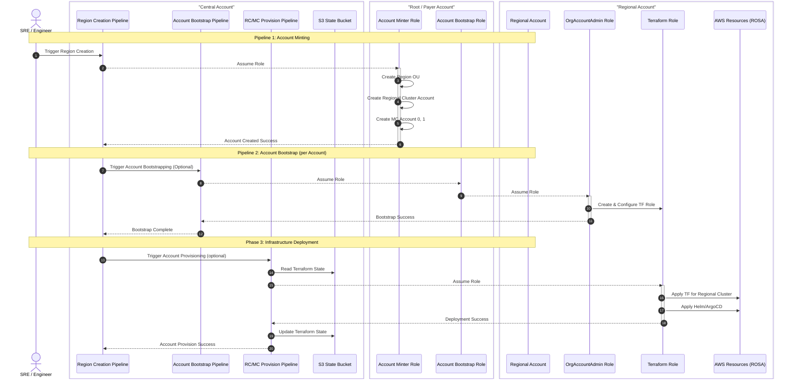

# Regional Account Minting Service

**Last Updated Date**: 2026-FEB-09

## Summary

AWS Account Minting will leverage a collection of idempotent pipelines in order to mint, bootstrap, and provision static regional accounts for a given region. We additionally define the OU structure and define which payer accounts to use for which environments:

```
control:
  rosa-regional-platform:
    prod:
      prod-us-east-1
      prod-eu-west-2
      ...

staging-1:
  rosa-regional-platform:
    int:
      int-us-east-2
    stage:
      stage-us-east-1
      stage-eu-west-2
      ...

staging-2:
  rosa-regional-platform:
    dev:
      dev-kirk-us-east-2
      dev-pete-eu-west-1
      ...
```

## Context

In order to provide a secure but repeatable environment that can be appropriately governed we need to define the structure of how we will group AWS Accounts within our payer-account structure per-environment as well as how to define the critera for the scope of the individual pipelines. Specific implementation details on the pipelines may change from the illustrative examples contained within this document, but the definition of what pipeline to use for what actions, and which context those pipelines will be running under is the important bits here.

## Design

The high-level design for the account-minting pipelines looks as follows:


There are three main classes of pipelines that will run from the central account:
* Account Minting
* Account Bootstrapping
* Account Provisioning

Each of these pipelines should be idempotent. They should be run at regular intervals that will ensure that there is no configuration drift. However as we build these individual pipelines as independent pieces they should be able to be run out-of-band at any time in order to do things like apply updates, create new regions, etc.

### Account Minting Pipeline

The Account Minting pipeline is responsible for the creation of the AWS Account and ensuring that the AWS accounts are in the correct OU, and have the correct tagging structure applied. This runs in the context of a role on the Payer Account itself that has the necessary permissions.

### Account Bootstrapping Pipeline

The Account Bootstrapping pipeline is responsible for the application of the individual resources necessary for other downstream pipelines to be run. At this time this includes the initial IAM Role setup, but can be further expanded as necessary. This pipeline runs in the context of the OrganizationAccountAccessRole on the individual regional account, chaining that access through the payer account. Because of the enhanced level of access this pipeline will have, we should limit this to the bare-minimum amount of resource creation that we need in order to run the provisioning pipeline successfully.

### Account Provisioning Pipeline

The Account Provisioning pipelines are the class of pipelines that are to be run against the various different accounts based on the account's role within a region. At the time of this writing there are two types of provisioning pipelines: Regional Cluster and Management Cluster. This number will expand over time, as we will further add log aggregation accounts, DR accounts, etc. Each pipeline will ensure that the correct resources for that account's role are added, and will further handle any additional setup as necessary. For example, the regional-cluster pipeline will apply the terraform necessary to create the regional EKS cluster, but then will have a further step to apply the helm charts so that it comes online with no further human interaction, etc.

### Example Account Creation Sequence Diagram



## Alternatives Considered

1. **AWS Control Tower**: AWS Control Tower provides a governance abstraction on new account minting. However this does not apply any new resources and is extremely web-console click-heavy, which would limit our ability to automate account minting at any kind of scale.
2. **AWS Account Factory for Terraform (AFT)**: AFT was considered, however this AWS Solution deploys a lengthy set of resources onto the target AWS Account. Without extensive experimentation, there's no indiciation that this can be deployed across multiple separate regions and/or load-balanced for any kind of regional-failover. There is also an additional maintenance burden, similar to any self-built solution since this is just a packaged AWS solution and not specifically an AWS hosted service.

## Design Rationale

* **Justification**: The solution as defined will allow us the same amount of flexibility that AWS Account Factory for Terraform offers without the extensive overhead of the deployed AWS Solution. The OU structure as defined will also allow us to leverage SCPs in order to further define governance policies based on environment (for example, if we want to leverage a [Multi-party approval process](https://docs.aws.amazon.com/mpa/latest/userguide/what-is.html) for break-glass into production clusters, while keeping int/stage environments on-demand break-glass). We further break each "region" into its own OU, so that we can further leverage AWS IAM Role conditions to [only allow access from within that OU](https://aws.amazon.com/blogs/security/how-to-control-access-to-aws-resources-based-on-aws-account-ou-or-organization/).

## Consequences

### Positive

* Idempotent pipelines allow the ability to run the pipelines as the process to apply changes as well as to ensure there's no configuration drift.
* Pipelines that are broken down into multiple, reusable pieces allow for the same processes to be used for future account provisioning services, such as on-demand scaling which may not go through the same global minting terraform service.

### Negative

* We must define and maintain the whole pipeline architecture
* We need to be the ones to define observability, since there's no out-of-the-box solution for this

## Cross-Cutting Concerns

N/A

### Reliability:

* **Scalability**: Since this solution leverages AWS-native services we should be able to "infinitely" scale, up to any cloud-provider limits.
* **Observability**: We need to ensure that we have and are able to export proper signal for reporting purposes and future debugability assuming something goes wrong.
* **Resiliency**: New Region creation will be limited if the AWS Services that run the pipelines or hold the S3 State are impacted. However, new regions will not often be created, so this may not be a concern.

### Security:

* This solution will implement a least-privileged access model, as well as short-lived AWS IAM role credentials for all operations.

### Performance:

* Care should be taken that any pipelines that can run in parallel during new-region creation can be. Our goal is to create a new region within an hour. For example, we can parallelize RC and MC cluster creation using a fan-out pattern, and then come back after those jobs are completed to register the MCs as consumers within the RC's Maestro instance.

### Cost:

* 

### Operability:

* We will need to consider how easy it will be to debug failures, as well as surface issues.

---

## Template Validation Checklist

Before finalizing a design decision document, verify:

### Structure Completeness
- [ ] Title is descriptive and action-oriented
- [ ] Last Updated Date is present and in ISO format (YYYY-MM-DD)
- [ ] All core sections are present: Summary, Context, Alternatives Considered, Design Rationale, Consequences
- [ ] Both positive and negative consequences are listed

### Content Quality
- [ ] Design statement is clear and unambiguous
- [ ] Problem statement articulates the "why"
- [ ] Constraints and assumptions are explicitly documented
- [ ] Rationale includes justification, evidence, and comparison
- [ ] Consequences are specific and actionable
- [ ] Trade-offs are honestly assessed

### Cross-Cutting Concerns
- [ ] Each included concern has concrete details (not just placeholders)
- [ ] Irrelevant sections have been removed
- [ ] Security implications are considered where applicable
- [ ] Cost impact is evaluated where applicable

### Best Practices
- [ ] Document is written in clear, accessible language
- [ ] Technical terms are used appropriately
- [ ] Document provides sufficient detail for future reference
- [ ] All placeholder text has been replaced
- [ ] Links to related documentation are included where relevant
