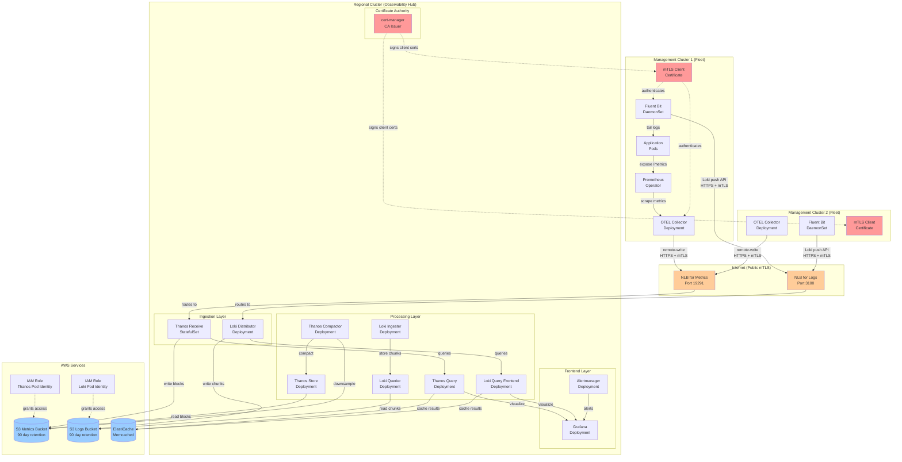
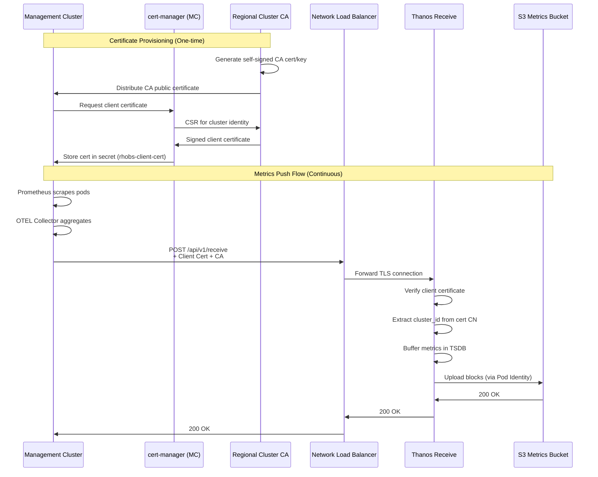
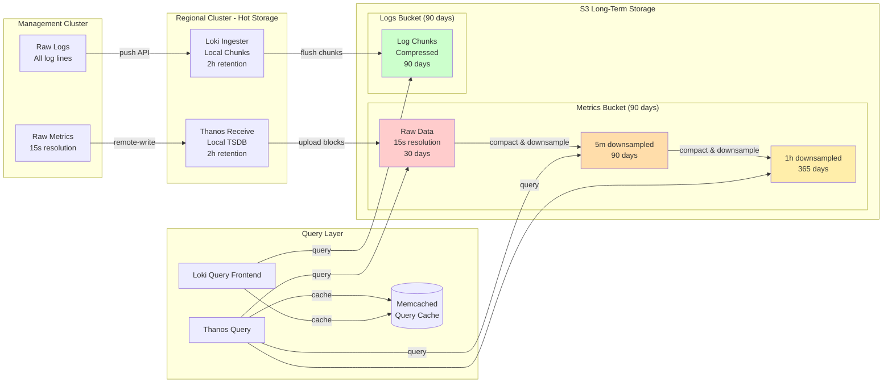
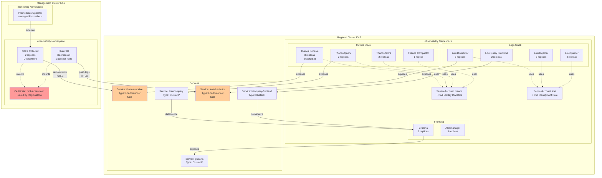
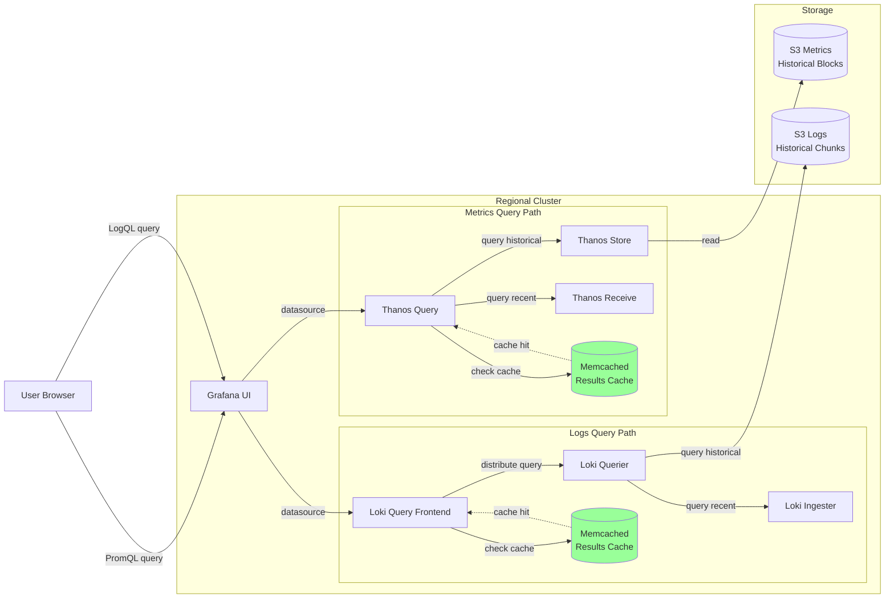
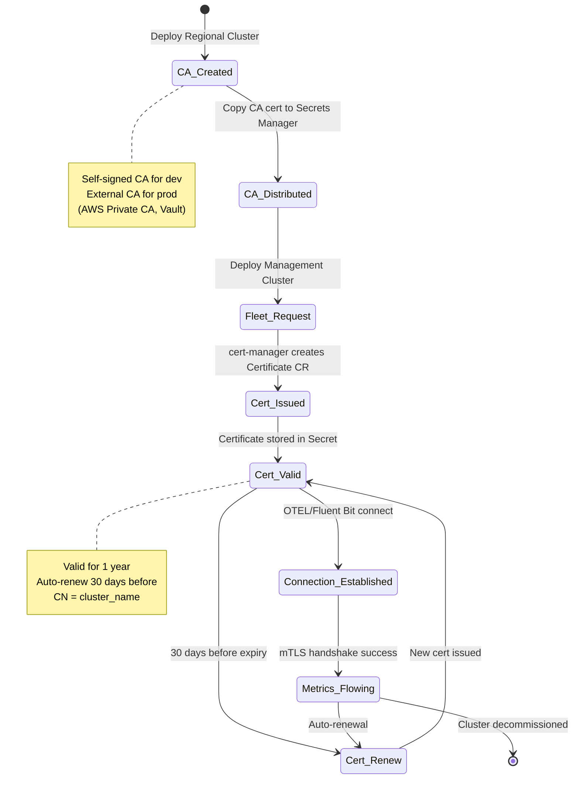
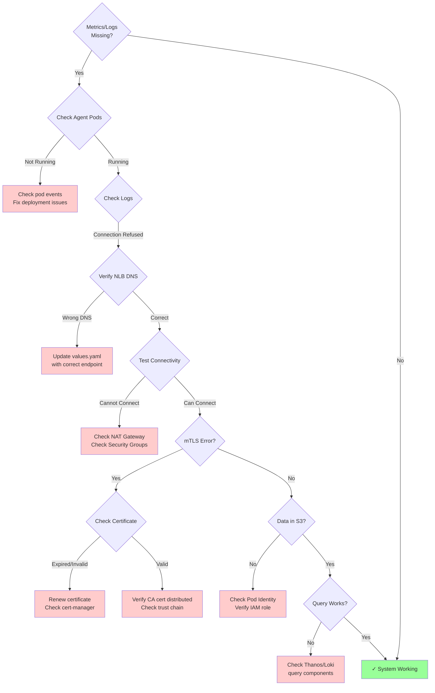

# RHOBS Architecture Diagrams

## High-Level Communication Flow



## Detailed mTLS Authentication Flow



## Data Storage and Retention Architecture



## Component Deployment Architecture



## Network and Security Architecture

```mermaid
graph TB
    subgraph "Management Cluster VPC"
        MC_Nodes[EKS Worker Nodes<br/>Private Subnets]
        MC_NAT[NAT Gateway<br/>Public Subnet]
        MC_IGW[Internet Gateway]

        MC_Nodes -->|egress traffic| MC_NAT
        MC_NAT -->|route to| MC_IGW
    end

    subgraph "Internet"
        Internet((Internet))
    end

    subgraph "Regional Cluster VPC"
        RC_IGW[Internet Gateway]
        RC_Public[Public Subnets]
        RC_Private[Private Subnets<br/>EKS Worker Nodes]
        RC_NLB_Metrics[NLB for Metrics<br/>internet-facing]
        RC_NLB_Logs[NLB for Logs<br/>internet-facing]

        RC_IGW -->|routes to| RC_Public
        RC_Public -->|hosts| RC_NLB_Metrics
        RC_Public -->|hosts| RC_NLB_Logs
        RC_NLB_Metrics -->|forwards to| RC_Private
        RC_NLB_Logs -->|forwards to| RC_Private

        subgraph "Security Groups"
            SG_Thanos[Thanos Receive Pod<br/>Allow 19291 from NLB]
            SG_Loki[Loki Distributor Pod<br/>Allow 3100 from NLB]
            SG_Cache[ElastiCache SG<br/>Allow 11211 from EKS]
        end

        RC_Private -->|pods use| SG_Thanos
        RC_Private -->|pods use| SG_Loki
    end

    subgraph "AWS Managed Services"
        Cache[(ElastiCache<br/>Private Subnets)]
        S3[(S3 Buckets<br/>VPC Endpoint)]

        RC_Private -->|queries| Cache
        RC_Private -->|stores| S3
    end

    MC_IGW -->|HTTPS + mTLS| Internet
    Internet -->|HTTPS + mTLS| RC_IGW

    style MC_NAT fill:#99ccff
    style RC_NLB_Metrics fill:#ffcc99
    style RC_NLB_Logs fill:#ffcc99
    style SG_Thanos fill:#ffcccc
    style SG_Loki fill:#ffcccc
    style SG_Cache fill:#ffcccc
```

## Query Path Architecture



## Certificate Lifecycle



## Troubleshooting Decision Tree


