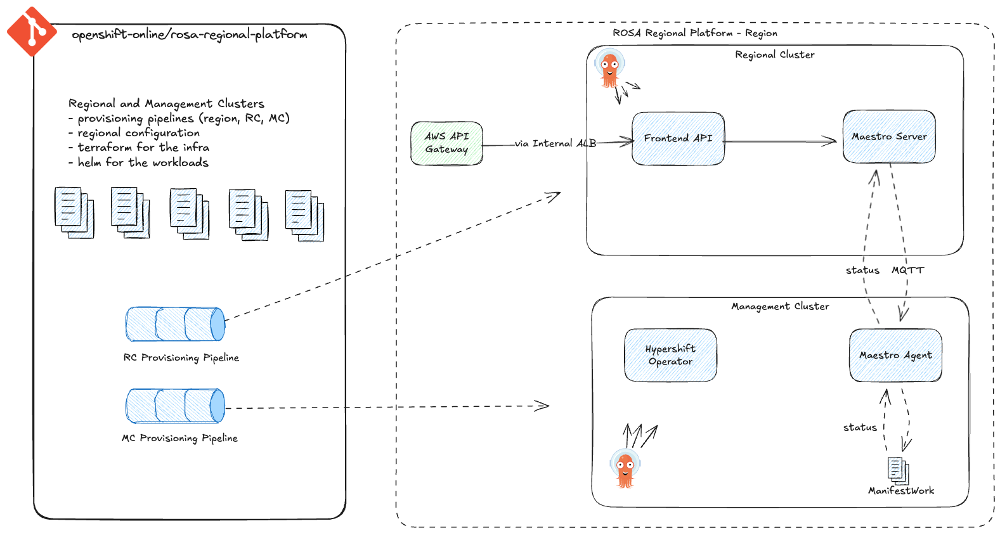
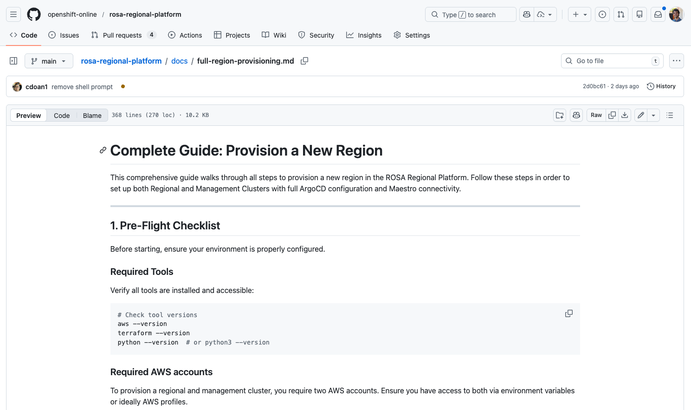
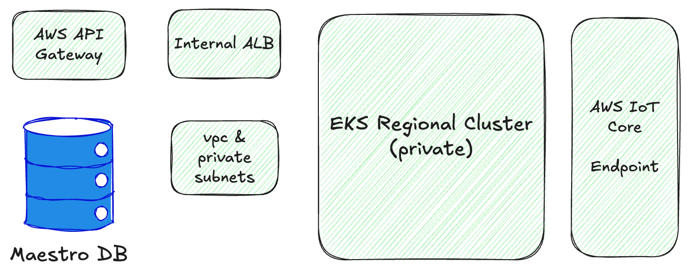
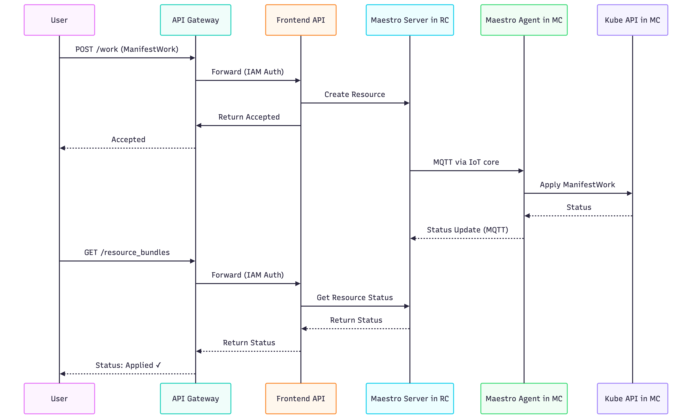

# ROSA Regional Platform

✅ [ROSA-666 - Milestone 1 - Deploy a Regional Cluster + Management Cluster](https://issues.redhat.com/browse/ROSA-666) (part of [ROSA-659](https://issues.redhat.com/browse/ROSA-659)).

_A platform engineer can deploy a new region manually, composed of an EKS Regional Cluster (RC) and EKS Management Cluster (MC). They can submit a resource via the Platform API, and see it applied in the MC via Maestro, and receive status feedback._

---
layout: default
---

# What We've Built



---

# Complete Guide: Provision a New Region

<div></div>

[docs / full-region-provisioning.md](https://github.com/openshift-online/rosa-regional-platform/blob/main/docs/full-region-provisioning.md)




---

# Declare a New Region

<div></div>

Define your region in Git, render the ArgoCD manifests, commit.

<div class="grid grid-cols-2 gap-4">
<div>

### 1. Edit [config.yaml](https://github.com/openshift-online/rosa-regional-platform/blob/main/config.yaml)

```yaml
shards:
  - region: "us-west-2"
    environment: "integration"
    values:
      management-cluster:
        hypershift:
          oidcStorageS3Bucket:
            name: "hypershift-mc-us-west-2"
            region: "us-west-2"
```

</div>
<div>

### 2. Render & Commit

```bash
# Generate all deploy/ configs
# for the new region based on
# config.yaml via scripts/render.py

git add config.yaml deploy/
git commit -m "Add us-west-2 region"
git push
```

</div>
</div>

---

# Regional Cluster Provisioning

<div></div>

Provision the Regional Cluster infrastructure with Terraform.

<div class="grid grid-cols-2 gap-4">
<div>

### Commands

```bash
# Configure terraform variables
cp terraform/.../terraform.tfvars.example \
   terraform/.../terraform.tfvars

# Provision Regional Cluster
make provision-regional
```
This runs a terraform that provisions all the Regional Cluster infrastructure.

</div>
<div>

### What Gets Created



</div>
</div>

---

# ArgoCD Bootstrap & Workloads

<div></div>

As part of `make provision-regional`, an **ECS Fargate task** runs to **install ArgoCD**, then GitOps takes over. **ArgoCD** automatically **deploys all Regional Cluster workloads** from Git.


---

# Maestro IoT Setup

<div></div>

All the clusters (Regional and Management Cluster) communicate using Maestro over MQTT. This requires:

```bash
# In the Regional Account - Provision IoT resources
make provision-maestro-agent-iot-regional
```

This creates:

- Certificate + Private Key (download files)
- Set up IoT Policy for that certificate

<br/>

```bash
# Then, in the Management Account
make provision-maestro-agent-iot-management
```

This uploads the certificate to AWS Secrets Manager and will be referenced by the Maestro Agent deployment.

---

# Management Cluster Provisioning

<div></div>

Provision the MC and configure Maestro Agent with IoT credentials.

<div class="grid grid-cols-2 gap-4">
<div>

### Commands

```bash
# Provision Management Cluster
make provision-management
```

This runs a terraform that provisions the Management Cluster.

</div>
<div>

### What Gets Created

- Private EKS Cluster
- ArgoCD (self-managing)
- HyperShift Operator (deployed by ArgoCD)
- Maestro Agent (deployed by ArgoCD) configured with IoT credentials

</div>
</div>

---

# Consumer Registration

<div></div>

Register the MC with the Regional Cluster's Maestro Server.

<div class="grid grid-cols-2 gap-4">
<div>


```bash
awscurl -X POST \
  https://$API_GATEWAY_URL/prod/api/v0/management_clusters \
  --service execute-api \
  --region us-west-2 \
  -H "Content-Type: application/json" \
  -d '{
    "name": "management-01",
    "labels": {
      "cluster_type": "management",
      "cluster_id": "management-01"
    }
  }'
```

The `API_GATEWAY_URL` can be found in the Regional Cluster terraform output.

</div>
<div>

### What This Does

Registers MC as a consumer in Maestro.

</div>
</div>

---

# End-to-End Verification

<div></div>

Apply a workload through the API and verify it reaches the MC.

<div class="grid grid-cols-2 gap-4">
<div>

### Apply Workload

```bash
# Post a ManifestWork
awscurl -X POST \
  https://$API_GATEWAY_URL/prod/api/v0/work \
  --service execute-api \
  --region us-west-2 \
  -d @payload.json

# Check status
awscurl \
  https://$API_GATEWAY_URL/prod/api/v0/resource_bundles \
  --service execute-api \
  --region us-west-2 | jq '.items[].status'
```

The `payload.json` is a ManifestWork resource documented in the [End-to-End Verification guide](https://github.com/openshift-online/rosa-regional-platform/blob/main/docs/full-region-provisioning.md#7-end-to-end-verification).

</div>
<div>

### Expected Result

```json
{
  "resourceStatus": {
    "conditions": [{
      "type": "Applied",
      "status": "True"
    }]
  }
}
```

✅ Workload successfully distributed via Maestro

</div>
</div>

---

# Request Flow

<div></div>



---
layout: center
class: text-center
---

# Milestone 1 Complete ✅

Regional Cluster and Management Cluster provisioned on EKS.

What's next?

[ROSA-667 -  Milestone 2 - Continuous Validation](https://issues.redhat.com/browse/ROSA-667)

[ROSA-668 -  Milestone 3 - HCPs run on EKS MCs](https://issues.redhat.com/browse/ROSA-668)
