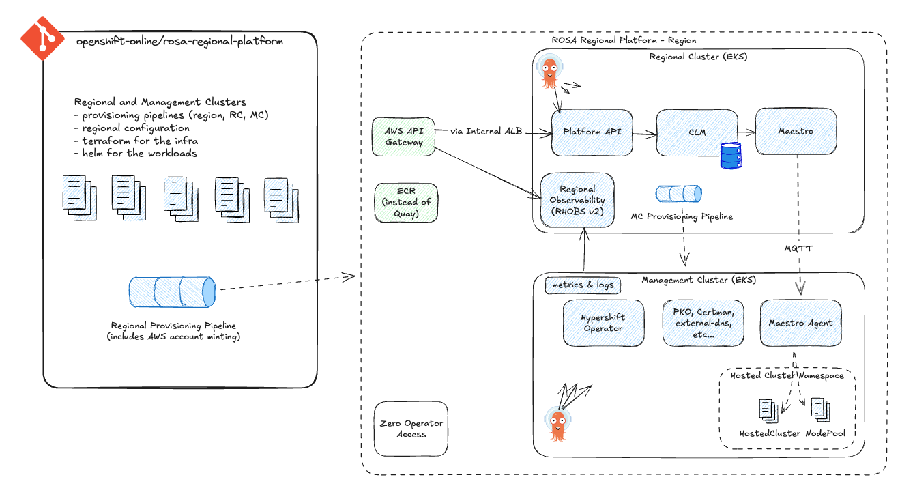
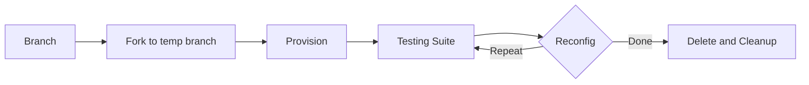
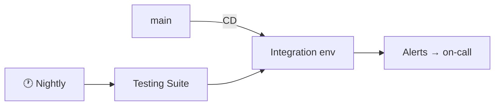
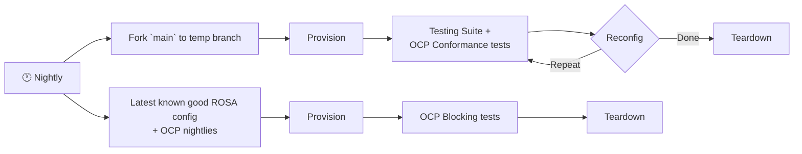

<!-- markdownlint-disable MD003 -->

# The ROSA Regional Platform

Building the next generation of ROSA HCP

[Blog Post](https://source.redhat.com/departments/products_and_global_engineering/hybrid_cloud_management/service_delivery_blog/the_rosa_regional_platform_building_the_next_generation_of_rosa_hcp) · [ROSA-659](https://issues.redhat.com/browse/ROSA-659) · [Repository](https://github.com/openshift-online/rosa-regional-platform)

---

## layout: default

# The New Architecture — Design Principles

## 🏗️ Architecture

- **AWS native** — all EKS, IAM (SigV4)
- **Simpler** — no ACM, no App-Interface, no legacy dependencies
- **CLM** replaces CS/AMS — single source of truth
- **Clear data flows** — CLM, Maestro, ArgoCD, PKO
- **Pipeline driven regions** — regions lifecycled via pipelines
- **Async**, eventually consistent
- **New APIs, new UX** — navigate by region (like AWS console)

## 🌍 Regional

- **All future clusters** provisioned through the regional architecture
- **All regional APIs** — no global endpoints
- **Regional independence** — failures contained per region
- **Data residency** — data stays in region
- **Rapid region deployment** — on demand
- **FedRAMP Moderate** target for US regions (FIPS-140)

## 🔐 Operations

- **Zero operator access** — audited breakglass only
- **Private** EKS Kube APIs (RC & MCs) — no network path between
- **Sectors** — progressive delivery via canary-style rollouts
- **CI** — pre-merge and nightlies provision regions and run e2e tests
- **AI** from the ground up

---

## layout: default

# Architecture

[Excalidraw source](https://link.excalidraw.com/readonly/v1TEPnH0bi6uYKTuaApK)

---

## layout: default

# Team

**6 engineers and 1 manager** — senior, self-driven, building greenfield infrastructure

- Full ownership from architecture through operations
- Proactive — making decisions quickly, iterating based on learnings
- Leveraging AI for development, debugging, and operations
- Every team member understands HyperShift and Management Cluster architecture
- Carries the pager for every environment from go-live

---

## layout: default

# Contributing Teams

| Team                     | Collaboration Area                                                   |
| ------------------------ | -------------------------------------------------------------------- |
| **HyperShift Operator**  | HyperShift on EKS — networking, storage, IAM integration             |
| **HyperShift ROSA**      | Upstream contributions — request serving nodes, SG optimization, ECR |
| **ROSA PKO**             | Content delivery and image management for hosted clusters            |
| **Hyperfleet**           | CLM (Cluster Lifecycle Manager) — new API replacing CS/AMS           |
| **Platform Engineering** | ArgoCD patterns, progressive delivery (ADR-300)                      |
| **RHOBS**                | Observability stack (RHOBS v2) — metrics, logs, dashboards, alerting |
| **GCP**                  | Cross-cloud alignment — shared components and patterns               |

---

## layout: default

# Main Repositories

| Repository                                                                                              | Description                                                    |
| ------------------------------------------------------------------------------------------------------- | -------------------------------------------------------------- |
| [rosa-regional-platform](https://github.com/openshift-online/rosa-regional-platform)                    | Main project repository — infrastructure, ArgoCD configs, docs |
| [rosa-regional-platform-internal](https://github.com/openshift-online/rosa-regional-platform-internal/) | Internal configurations and deployment values                  |
| [rosa-regional-platform-api](https://github.com/openshift-online/rosa-regional-platform-api/)           | Platform API specification and implementation                  |

## Additional Resources

- **Slack:** `#team-rosa-regional-platform`
- **Design Document:** [ROSA HCP Regionality Design](https://docs.google.com/document/d/1tdoTPIW5eiduGLLhxtjrMEt496Gkh-PpBAJjP4UGyvE/)
- **ADR 300:** [HCM Regional Architecture](https://issues.redhat.com/browse/HCM-ADR-0300)
- **FAQs:** [FAQ.md](https://github.com/openshift-online/rosa-regional-platform/blob/main/FAQ.md)

---

## layout: default

# CI Strategy

|               | Source    | Env           |
| ------------- | --------- | ------------- |
| **Pre-merge** | PR branch | Ephemeral     |
| **Nightly**   | main      | Persistent    |
| **Nightly**   | main      | Ephemeral x N |

**Testing suite:** Hosted Cluster lifecycle → workload validation

**Pre-merge** (from PR branch)

**Nightly: Integration** (always running)

**Nightly: Ephemeral** (from main, x N)

› <b>Temp branches</b> are used to push GitOps commits during testing without affecting source branches.

› <b>Reconfig</b> includes changes to the underlying regional infrastructure through gitops (config.yaml), as well as HCP Lifecycle through the Platform API

---

## layout: default

# Roadmap

[ROSA-659 — Operational Readiness](https://issues.redhat.com/browse/ROSA-659) — end of Q2 2026

  <a href="https://issues.redhat.com/browse/ROSA-666" class="roadmap-card roadmap-card--done">
    
1 · Deploy a Region

    
✅ Done

  </a>
  <a href="https://issues.redhat.com/browse/ROSA-667" class="roadmap-card roadmap-card--in-progress">
    
2 · Continuous Validation

    
🔨 In Progress

  </a>
  <a href="https://issues.redhat.com/browse/ROSA-668" class="roadmap-card roadmap-card--in-progress">
    
3 · HCPs on EKS MCs

    
🔨 In Progress

  </a>
  <a href="https://issues.redhat.com/browse/ROSA-669" class="roadmap-card roadmap-card--planned">
    
4 · Observability

    
Planned

  </a>
  <a href="https://issues.redhat.com/browse/ROSA-670" class="roadmap-card roadmap-card--in-progress">
    
5 · CLM Integration

    
🔨 In Progress

  </a>
  <a href="https://issues.redhat.com/browse/ROSA-671" class="roadmap-card roadmap-card--planned">
    
6 · Disaster Recovery

    
Planned

  </a>
  <a href="https://issues.redhat.com/browse/ROSA-672" class="roadmap-card roadmap-card--planned">
    
7 · Zero Operator Access

    
Planned

  </a>
  <a href="https://issues.redhat.com/browse/ROSA-673" class="roadmap-card roadmap-card--planned">
    
8 · Migrate My Cluster

    
Planned

  </a>

**After Q2 — path to GA**

  

    FEATURE PARITY
    Internal Preview
    →
    Private Preview
    →
    Public Preview
  

  →
  GA

