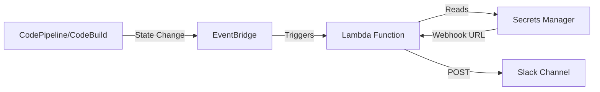

# Slack Notifications for Pipeline Failures

This guide walks through setting up Slack notifications for AWS CodePipeline and CodeBuild failures **without installing any Slack applications**. We use Slack's Incoming Webhooks feature which only requires adding a webhook to a channel.

## Architecture



**Components:**

- **EventBridge Rules**: Catch pipeline/build state changes (FAILED, STOPPED, SUPERSEDED)
- **Lambda Function**: Formats failure details and posts to Slack
- **Secrets Manager**: Stores Slack webhook URL securely
- **Slack Incoming Webhook**: Receives notifications (no app installation required)

## Pipeline Stages Monitored

For each pipeline (Regional Cluster and Management Cluster):

1. **Source Stage**: GitHub checkout failures
2. **Deploy Stage** (ApplyInfrastructure): Terraform provisioning failures
3. **Bootstrap-ArgoCD Stage**: ArgoCD bootstrap failures
4. **Overall Pipeline**: FAILED, STOPPED, or SUPERSEDED states

## Step 1: Create Slack Incoming Webhook

### 1.1 In Slack workspace (no app installation)

1. Go to your Slack workspace settings
2. Navigate to **Apps** → **Manage** → **Custom Integrations**
3. Click **Incoming Webhooks** → **Add to Slack**
4. Select the channel where you want notifications (e.g., `#pipeline-alerts`)
5. Click **Add Incoming WebHooks integration**
6. Copy the **Webhook URL** (looks like: `https://hooks.slack.com/services/T00000000/B00000000/XXXXXXXXXXXXXXXXXXXX`)

> **Note**: This does NOT install an app. It just adds a webhook endpoint to post messages to a channel.

### 1.2 Test the webhook (optional)

```bash
WEBHOOK_URL="https://hooks.slack.com/services/YOUR/WEBHOOK/URL"

curl -X POST "$WEBHOOK_URL" \
  -H 'Content-Type: application/json' \
  -d '{"text": "Test notification from pipeline setup"}'
```

You should see a test message appear in your Slack channel.

## Step 2: Store Webhook URL in AWS Secrets Manager

Store the webhook URL securely in AWS Secrets Manager in your **Central account** (where CodePipeline runs):

```bash
# Set your AWS profile for the Central account
export AWS_PROFILE=central-account

# Store the webhook URL
aws secretsmanager create-secret \
  --name pipeline-notifications/slack-webhook \
  --description "Slack webhook URL for pipeline failure notifications" \
  --secret-string "https://hooks.slack.com/services/YOUR/WEBHOOK/URL" \
  --region us-east-1  # Use your pipeline region

# Verify it was stored
aws secretsmanager get-secret-value \
  --secret-id pipeline-notifications/slack-webhook \
  --region us-east-1 \
  --query SecretString --output text
```

> **Security Note**: Secrets Manager encrypts the webhook URL at rest and controls access via IAM.

## Step 3: Deploy the Notification Infrastructure

### 3.1 Add the notification module to your pipeline config

For **Regional Cluster Pipeline** - edit [`terraform/config/pipeline-regional-cluster/main.tf`](../terraform/config/pipeline-regional-cluster/main.tf):

```hcl
# Add this after the pipeline resource
module "pipeline_notifications" {
  source = "../../modules/pipeline-notifications"

  pipeline_name         = aws_codepipeline.central_pipeline.name
  slack_webhook_secret  = "pipeline-notifications/slack-webhook"
  notification_channels = ["#pipeline-alerts"]

  # Optional: customize which events to notify on
  notify_on_failed      = true
  notify_on_stopped     = true
  notify_on_superseded  = false  # Set to true if you want notifications for superseded pipelines

  tags = {
    Environment = var.target_environment
    Region      = var.target_region
    Pipeline    = "regional-cluster"
  }
}
```

For **Management Cluster Pipeline** - edit [`terraform/config/pipeline-management-cluster/main.tf`](../terraform/config/pipeline-management-cluster/main.tf):

```hcl
# Add this after the pipeline resource
module "pipeline_notifications" {
  source = "../../modules/pipeline-notifications"

  pipeline_name         = aws_codepipeline.central_pipeline.name
  slack_webhook_secret  = "pipeline-notifications/slack-webhook"
  notification_channels = ["#pipeline-alerts"]

  notify_on_failed      = true
  notify_on_stopped     = true

  tags = {
    Environment = var.target_environment
    Region      = var.target_region
    Pipeline    = "management-cluster"
  }
}
```

### 3.2 Apply the Terraform changes

```bash
cd terraform/config/pipeline-regional-cluster
terraform init
terraform plan  # Review the changes
terraform apply

cd ../pipeline-management-cluster
terraform init
terraform plan
terraform apply
```

## Step 4: Verify Notifications

### 4.1 Test with a deliberate failure

Create a test branch with an intentional error:

```bash
git checkout -b test-pipeline-notifications

# Add an invalid terraform file
echo 'invalid syntax {' > terraform/config/regional-cluster/test-fail.tf

git add .
git commit -m "test: trigger pipeline failure for notification testing"
git push origin test-pipeline-notifications
```

The pipeline should fail during the Deploy stage, and you should receive a Slack notification.

### 4.2 Expected Slack message format

```
❌ Pipeline Failed: regional-us-east-1-pipe

Pipeline: regional-us-east-1-pipe
Status: FAILED
Stage: Deploy
Action: ApplyInfrastructure
Region: us-east-1
Time: 2026-03-16T15:30:45Z

View Pipeline: https://console.aws.amazon.com/codesuite/codepipeline/pipelines/regional-us-east-1-pipe/view
View Logs: https://console.aws.amazon.com/cloudwatch/home?region=us-east-1#logsV2:log-groups
```

### 4.3 Clean up test

```bash
git checkout main
git branch -D test-pipeline-notifications
git push origin --delete test-pipeline-notifications

# Remove test file if it was committed to main
git rm terraform/config/regional-cluster/test-fail.tf
git commit -m "Remove test file"
```

## Event Types Monitored

The notification system monitors these CodePipeline states:

| State        | Description                                    | Notification? |
| ------------ | ---------------------------------------------- | ------------- |
| `FAILED`     | Pipeline execution failed                      | ✅ Yes        |
| `STOPPED`    | Pipeline execution was manually stopped        | ✅ Yes        |
| `SUPERSEDED` | Pipeline execution was superseded by newer run | ⚠️ Optional   |
| `SUCCEEDED`  | Pipeline execution completed successfully      | ❌ No         |

For CodeBuild projects (individual stages):

| State       | Description                  | Notification? |
| ----------- | ---------------------------- | ------------- |
| `FAILED`    | Build failed                 | ✅ Yes        |
| `STOPPED`   | Build was manually stopped   | ✅ Yes        |
| `TIMED_OUT` | Build exceeded timeout       | ✅ Yes        |
| `SUCCEEDED` | Build completed successfully | ❌ No         |

## Customization

### Change notification channel

Edit the module configuration:

```hcl
module "pipeline_notifications" {
  # ...
  notification_channels = ["#my-custom-channel"]
}
```

### Add multiple webhooks for different channels

You can create separate secrets for different channels:

```bash
aws secretsmanager create-secret \
  --name pipeline-notifications/slack-webhook-critical \
  --secret-string "https://hooks.slack.com/services/YOUR/CRITICAL/WEBHOOK"
```

Then reference it in the module:

```hcl
module "pipeline_notifications" {
  # ...
  slack_webhook_secret = "pipeline-notifications/slack-webhook-critical"
}
```

### Customize notification format

Edit [`terraform/modules/pipeline-notifications/lambda/notify.py`](../terraform/modules/pipeline-notifications/lambda/notify.py) to change the message format.

## Troubleshooting

### Notifications not appearing

1. **Check EventBridge rules are enabled:**

   ```bash
   aws events list-rules --name-prefix "pipeline-notification"
   ```

2. **Check Lambda execution:**

   ```bash
   aws logs tail /aws/lambda/pipeline-notification-handler --follow
   ```

3. **Verify webhook URL is correct:**

   ```bash
   aws secretsmanager get-secret-value \
     --secret-id pipeline-notifications/slack-webhook \
     --query SecretString --output text
   ```

4. **Test Lambda manually:**
   ```bash
   aws lambda invoke \
     --function-name pipeline-notification-handler \
     --payload '{"test": true}' \
     /tmp/lambda-output.json
   ```

### Lambda permission errors

Ensure the Lambda execution role has:

- `secretsmanager:GetSecretValue` for the webhook secret
- `logs:CreateLogGroup`, `logs:CreateLogStream`, `logs:PutLogEvents` for CloudWatch Logs

## Security Considerations

- ✅ Webhook URL stored encrypted in Secrets Manager
- ✅ Lambda execution role uses least-privilege permissions
- ✅ No Slack app installation required (just webhook)
- ✅ Webhook URL never exposed in logs or environment variables
- ⚠️ Slack webhook URLs should be rotated periodically
- ⚠️ Consider enabling Secrets Manager rotation for production

## Cost Estimate

For typical usage (a few pipeline runs per day):

- EventBridge: ~$0.00 (first 14 million events/month free)
- Lambda: ~$0.00 (first 1 million requests free)
- Secrets Manager: ~$0.40/month per secret
- **Total: < $1/month**

## Further Reading

- [AWS CodePipeline EventBridge Events](https://docs.aws.amazon.com/codepipeline/latest/userguide/detect-state-changes-cloudwatch-events.html)
- [Slack Incoming Webhooks](https://api.slack.com/messaging/webhooks)
- [AWS Secrets Manager Best Practices](https://docs.aws.amazon.com/secretsmanager/latest/userguide/best-practices.html)
