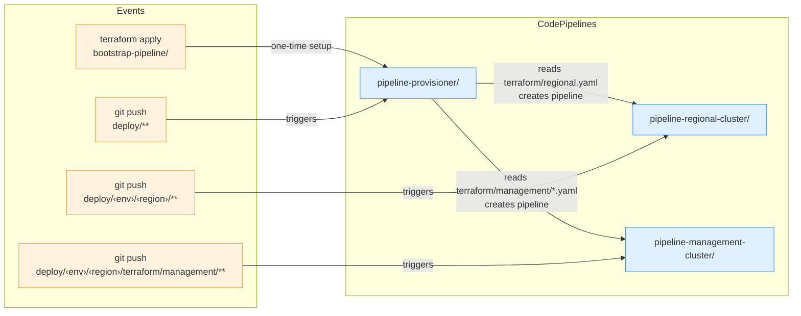

# Terraform Configurations

## CI/CD Pipelines

### `bootstrap-pipeline/`

Seeds the initial CodePipeline that watches the `deploy/` directory in the repository. When cluster configuration files are added or updated, it triggers the pipeline provisioner to dynamically create the corresponding CodePipelines.

Cluster configurations follow this directory structure:

- `deploy/<env>/<region_alias>/terraform/regional.yaml` — regional cluster pipelines
- `deploy/<env>/<region_alias>/terraform/management/<cluster>.yaml` — management cluster pipelines

After deploying, the GitHub CodeStar connection must be authorized manually:

1. Navigate to AWS Console > Developer Tools > Connections
2. Select the pending connection and authorize with GitHub

### `pipeline-provisioner/`

Meta-pipeline that dynamically creates per-cluster CodePipelines when regional or management cluster YAML files are committed to `deploy/`.

### `pipeline-regional-cluster/`

Three-stage CodePipeline (validate → deploy → bootstrap) for provisioning a regional cluster. Created dynamically by the pipeline provisioner.

### `pipeline-management-cluster/`

Three-stage CodePipeline (validate → deploy → bootstrap) for provisioning a management cluster. Created dynamically by the pipeline provisioner.

## Cluster Infrastructure

### `regional-cluster/`

Provisions the full regional cluster stack: EKS, VPC, API Gateway, Maestro IoT broker, RDS, authorization (DynamoDB + Pod Identity), ECS bootstrap, and optional bastion.

### `management-cluster/`

Provisions a management cluster: private EKS (1–2 nodes), ECS bootstrap, Maestro agent, and optional bastion. Hosts customer control planes.

### `maestro-agent-iot-provisioning/`

Standalone wrapper around the `maestro-agent-iot-provisioning` module for pipeline-based IoT provisioning. Provisions AWS IoT Core certificates and policies for Maestro agents in management clusters.

Usage:

1. Generate `terraform.tfvars` with cluster-specific values
2. Run `terraform init && terraform apply`
3. Extract certificate data: `terraform output -json certificate_data`
4. Transfer to management account Secrets Manager
