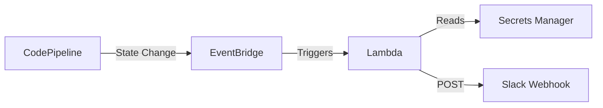

# Pipeline Notifications Module

Terraform module to send AWS CodePipeline failure notifications to Slack using EventBridge and Lambda.

## Features

- Monitors CodePipeline execution state changes (FAILED, STOPPED, SUPERSEDED)
- Monitors individual stage and action failures
- Sends formatted notifications to Slack via Incoming Webhooks
- No Slack app installation required
- Secure webhook URL storage in AWS Secrets Manager
- Customizable notification events
- CloudWatch Logs integration for debugging

## Architecture



## Prerequisites

1. **Slack Incoming Webhook**: Create a webhook in your Slack workspace
2. **AWS Secrets Manager Secret**: Store the webhook URL in Secrets Manager

### Create Slack Webhook

1. Go to your Slack workspace settings
2. Navigate to **Apps** → **Manage** → **Custom Integrations**
3. Click **Incoming Webhooks** → **Add to Slack**
4. Select channel and copy webhook URL

### Store Webhook in Secrets Manager

```bash
aws secretsmanager create-secret \
  --name pipeline-notifications/slack-webhook \
  --secret-string "https://hooks.slack.com/services/YOUR/WEBHOOK/URL" \
  --region us-east-1
```

## Usage

```hcl
module "pipeline_notifications" {
  source = "../../modules/pipeline-notifications"

  pipeline_name         = aws_codepipeline.my_pipeline.name
  slack_webhook_secret  = "pipeline-notifications/slack-webhook"
  notification_channels = ["#pipeline-alerts"]

  notify_on_failed      = true
  notify_on_stopped     = true
  notify_on_superseded  = false

  tags = {
    Environment = "production"
    Team        = "platform"
  }
}
```

## Examples

### Basic Usage

```hcl
module "pipeline_notifications" {
  source = "../../modules/pipeline-notifications"

  pipeline_name = "my-pipeline"
}
```

### Custom Configuration

```hcl
module "pipeline_notifications" {
  source = "../../modules/pipeline-notifications"

  pipeline_name         = "regional-us-east-1-pipe"
  slack_webhook_secret  = "custom/slack-webhook"
  notification_channels = ["#critical-alerts", "#platform-team"]

  notify_on_failed      = true
  notify_on_stopped     = false
  notify_on_superseded  = true

  log_retention_days = 14

  tags = {
    Environment = "production"
    Region      = "us-east-1"
    ManagedBy   = "terraform"
  }
}
```

## Inputs

| Name                  | Description                                                  | Type           | Default                                  | Required |
| --------------------- | ------------------------------------------------------------ | -------------- | ---------------------------------------- | -------- |
| pipeline_name         | Name of the CodePipeline to monitor                          | `string`       | -                                        | yes      |
| slack_webhook_secret  | AWS Secrets Manager secret name containing Slack webhook URL | `string`       | `"pipeline-notifications/slack-webhook"` | no       |
| notification_channels | List of Slack channels (for display purposes)                | `list(string)` | `["#pipeline-alerts"]`                   | no       |
| notify_on_failed      | Send notifications when pipeline fails                       | `bool`         | `true`                                   | no       |
| notify_on_stopped     | Send notifications when pipeline is stopped                  | `bool`         | `true`                                   | no       |
| notify_on_superseded  | Send notifications when pipeline is superseded               | `bool`         | `false`                                  | no       |
| log_retention_days    | Number of days to retain Lambda CloudWatch logs              | `number`       | `7`                                      | no       |
| tags                  | Tags to apply to all resources                               | `map(string)`  | `{}`                                     | no       |

## Outputs

| Name                  | Description                                         |
| --------------------- | --------------------------------------------------- |
| lambda_function_arn   | ARN of the Lambda function handling notifications   |
| lambda_function_name  | Name of the Lambda function                         |
| eventbridge_rule_arns | ARNs of EventBridge rules (pipeline, stage, action) |
| log_group_name        | CloudWatch Log Group name for Lambda logs           |

## Event Types

The module monitors three types of CodePipeline events:

### 1. Pipeline Execution State Change

Monitors overall pipeline execution state:

- `FAILED` - Pipeline execution failed
- `STOPPED` - Pipeline execution was manually stopped
- `SUPERSEDED` - Pipeline execution was superseded by newer execution

### 2. Stage Execution State Change

Monitors individual pipeline stage state:

- `FAILED` - Stage execution failed
- `STOPPED` - Stage execution was stopped

### 3. Action Execution State Change

Monitors individual action state within stages:

- `FAILED` - Action execution failed
- `STOPPED` - Action execution was stopped

## Slack Message Format

Notifications include:

- **Pipeline Name**: Name of the failed pipeline
- **Status**: Current state (FAILED, STOPPED, etc.)
- **Stage**: Name of the failed stage (if applicable)
- **Action**: Name of the failed action (if applicable)
- **Execution ID**: Unique execution identifier
- **Region**: AWS region
- **Timestamp**: When the failure occurred
- **Links**: Direct links to pipeline console and CloudWatch logs

Example:

```
❌ Pipeline FAILED: regional-us-east-1-pipe

Pipeline: regional-us-east-1-pipe
Status: FAILED
Stage: Deploy
Action: ApplyInfrastructure
Region: us-east-1
Time: 2026-03-16 15:30:45 UTC

Links: View Pipeline | View Logs
```

## Debugging

### View Lambda logs

```bash
aws logs tail /aws/lambda/PIPELINE_NAME-notification-handler --follow
```

### Test Lambda manually

```bash
aws lambda invoke \
  --function-name PIPELINE_NAME-notification-handler \
  --payload '{"test": true}' \
  /tmp/output.json
```

### Check EventBridge rules

```bash
aws events list-rules --name-prefix "PIPELINE_NAME"
```

## Security

- Webhook URL stored encrypted in Secrets Manager
- Lambda execution role uses least-privilege IAM permissions
- CloudWatch Logs for audit trail
- No sensitive data in environment variables or logs

## Cost

For typical usage (few pipeline runs per day):

- EventBridge: Free tier (14M events/month)
- Lambda: Free tier (1M requests/month)
- Secrets Manager: ~$0.40/month per secret
- CloudWatch Logs: ~$0.50/GB ingested

**Estimated total: < $1/month**

## Requirements

| Name      | Version |
| --------- | ------- |
| terraform | >= 1.0  |
| aws       | >= 5.0  |

## Resources Created

- `aws_lambda_function` - Notification handler
- `aws_iam_role` - Lambda execution role
- `aws_iam_role_policy` - Lambda permissions
- `aws_cloudwatch_log_group` - Lambda logs
- `aws_cloudwatch_event_rule` (3x) - EventBridge rules for pipeline/stage/action
- `aws_cloudwatch_event_target` (3x) - EventBridge targets
- `aws_lambda_permission` (3x) - EventBridge invoke permissions

## License

This module is part of the ROSA Regional Platform project.
