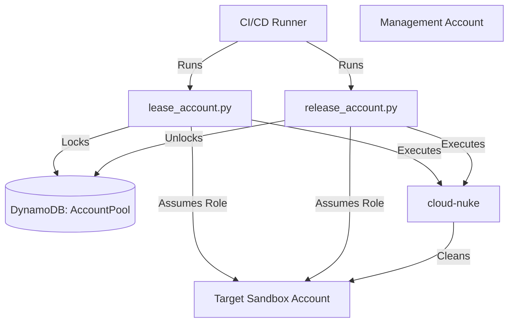

# Design Document: AWS Sandbox Account Leasing System

## 1. Problem Statement

In regulated environments like FedRAMP, creating and deleting AWS accounts on-demand is often restricted, slow, or rate-limited. This poses a significant challenge for automated testing pipelines (e.g., EKS testing) that require pristine, isolated environments for every run. Running tests serially in a single account is slow and prone to "resource leaks" where previous tests interfere with subsequent ones.

## 2. Solution Overview

The solution implements a **Pool of Reusable Sandbox Accounts** managed by a "Lease/Release" mechanism. Instead of creating accounts, we "lease" an existing one from a pre-provisioned pool, use it, clean it ("nuke"), and return it to the pool.

Key Design Goals:
1.  **Isolation:** Only one test runner can hold a specific account at a time.
2.  **Clean State:** Accounts are nuked before usage (during lease) and after usage (during release).
3.  **Automation:** The process is scriptable and integrates into CI/CD (CodeBuild or other CI/CD).
4.  **Observability:** Detailed logging provides visibility into the state of the pool and the cleanup process.

## 3. Architecture

### 3.1 Component Diagram

### 3.2 State Machine

Accounts in the DynamoDB table transition through the following states:

1.  **AVAILABLE:** The account is free and ready to be leased.
2.  **IN_USE:** The account is currently locked by a test runner.
3.  **DIRTY:** The account encountered an error during `cloud-nuke` or provisioning and requires manual intervention.

**Transitions:**
*   `AVAILABLE` -> `IN_USE`: On successful lease (Atomically locked).
*   `IN_USE` -> `AVAILABLE`: On successful release (after cleanup).
*   `IN_USE` -> `DIRTY`: If `cloud-nuke` fails during release.
*   `AVAILABLE` -> `DIRTY`: If `cloud-nuke` fails during lease (before returning to user).

## 4. Detailed Workflow

### 4.1 Leasing (Acquisition)
1.  **Scan:** The script scans DynamoDB for accounts with status `AVAILABLE`.
2.  **Lock:** It attempts to atomically update the status to `IN_USE` using a conditional write. If the write fails (race condition), it tries the next account.
3.  **Assume Role:** It assumes `OrganizationAccountAccessRole` in the target account.
4.  **Pre-Flight Nuke:** It runs `cloud-nuke` to ensure the account is truly empty. If this fails, the account is marked `DIRTY` and the script retries with another account.
5.  **Provision Identity:** It creates a temporary IAM user (`sandbox-temporary-user`) with `AdministratorAccess`.
6.  **Return:** It outputs the credentials for this temporary user to `stdout` as JSON.

### 4.2 Releasing (Recycling)
1.  **Validate:** Checks that the account is currently `IN_USE`.
2.  **Assume Role:** Assumes `OrganizationAccountAccessRole`.
3.  **Cleanup:**
    *   Runs `cloud-nuke` targeting the specific region (`--region` flag).
    *   Deletes the temporary IAM user and its policies/keys.
4.  **Unlock:** Updates the status to `AVAILABLE`.

## 5. Security & Safety

*   **Role Assumption:** The system relies on the `OrganizationAccountAccessRole` existing in the target accounts and trusted by the management account's automation user.
*   **Scoped Nuking:** `cloud-nuke` is explicitly scoped to the configured `AWS_REGION` to prevent accidental deletion of resources in other regions (though sandbox accounts should generally be empty everywhere).
*   **Isolation:** Temporary IAM users are unique per session (recreated) and have no access to other accounts.

## 6. Configuration

Configuration is managed via Environment Variables to allow flexibility across environments:
*   `DYNAMODB_TABLE_NAME`: The state table.
*   `AWS_REGION`: The operating region.
*   `LEASE_TIMEOUT`: Timeout for acquiring a lease.
